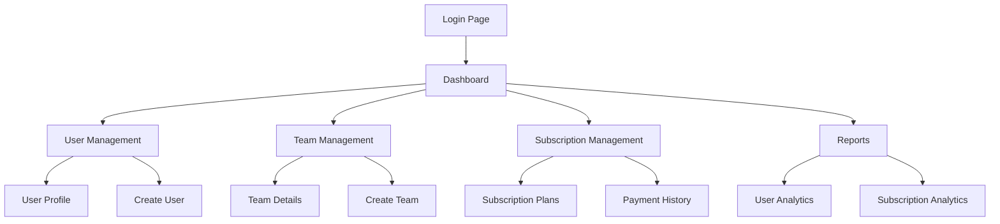

## 1. Product Overview
Modern admin panel for user and subscription management with intuitive interface and comprehensive team management capabilities.
- Enables administrators to manage users, teams, and subscription plans efficiently
- Provides real-time insights into user activities and subscription statuses
- Streamlines administrative workflows with a clean, professional interface

## 2. Core Features

### 2.1 User Roles
| Role | Registration Method | Core Permissions |
|------|---------------------|------------------|
| Admin | Pre-configured system account | Full system access, user management, subscription control, team creation |
| Manager | Admin invitation/creation | User management within assigned teams, subscription monitoring |
| Viewer | Admin/manager assignment | Read-only access to user data and reports |

### 2.2 Feature Module
Modern admin panel requirements consist of the following main pages:
1. **Dashboard**: Overview statistics, quick actions, recent activities
2. **User Management**: User list, user profiles, user creation/editing
3. **Team Management**: Team creation, team member assignment, team settings
4. **Subscription Management**: Subscription plans, user subscriptions, payment tracking
5. **Reports**: User analytics, subscription analytics, team performance

### 2.3 Page Details
| Page Name | Module Name | Feature description |
|-----------|-------------|---------------------|
| Dashboard | Statistics Panel | Display total users, active subscriptions, revenue metrics, team count |
| Dashboard | Quick Actions | Create user, create team, view reports shortcuts |
| Dashboard | Activity Feed | Show recent user registrations, subscription changes, team updates |
| User Management | User List | Search, filter, sort users by name, email, subscription status, registration date |
| User Management | User Profile | View detailed user information, subscription history, team memberships, activity log |
| User Management | User Actions | Create new user, edit user details, assign to teams, manage subscriptions |
| Team Management | Team List | Display all teams with member count, creation date, team lead information |
| Team Management | Team Details | View team members, team performance metrics, team settings |
| Team Management | Team Creation | Create new teams, assign team leads, set team permissions |
| Subscription Management | Subscription Plans | Manage monthly, quarterly, yearly subscription plans and pricing |
| Subscription Management | User Subscriptions | Track individual user subscriptions, renewal dates, payment status |
| Subscription Management | Payment History | View payment transactions, failed payments, refund requests |
| Reports | User Analytics | User registration trends, active user metrics, user retention rates |
| Reports | Subscription Analytics | Revenue trends, subscription conversion rates, churn analysis |
| Reports | Team Performance | Team productivity metrics, member engagement, goal achievement |

## 3. Core Process

### Admin Flow
1. Login to admin panel with secure authentication
2. View dashboard overview with key metrics
3. Navigate to user management to create/view/edit users
4. Create teams and assign users to teams
5. Set up subscription plans and monitor user subscriptions
6. Generate and view various reports for insights

### User Management Flow
1. Search and filter users based on criteria
2. View detailed user profiles with all relevant information
3. Perform bulk actions on multiple users
4. Export user data for external analysis

### Team Management Flow
1. Create new teams with specific purposes
2. Assign team leads and members
3. Configure team permissions and settings
4. Monitor team performance and activities

### Subscription Management Flow
1. Configure subscription plans (monthly/quarterly/yearly)
2. Monitor active subscriptions and renewal dates
3. Track payment status and handle failed payments
4. Analyze subscription metrics and revenue trends

## 4. User Interface Design

### 4.1 Design Style
- **Primary Colors**: Professional blue (#2563eb) for primary actions, dark gray (#1f2937) for text
- **Secondary Colors**: Light gray (#f3f4f6) for backgrounds, success green (#10b981) for positive indicators
- **Button Style**: Modern rounded buttons with subtle shadows and hover effects
- **Font**: Inter font family with clear hierarchy (14px base, 16px for content, 20px+ for headings)
- **Layout Style**: Card-based layout with consistent spacing, top navigation with sidebar menu
- **Icons**: Material Design icons for consistency and professional appearance

### 4.2 Page Design Overview
| Page Name | Module Name | UI Elements |
|-----------|-------------|-------------|
| Dashboard | Statistics Panel | Large metric cards with icons, gradient backgrounds, animated number counters |
| Dashboard | Quick Actions | Icon-based action buttons with hover animations, organized in grid layout |
| Dashboard | Activity Feed | Timeline-style feed with user avatars, timestamps, and action descriptions |
| User Management | User List | Data table with search bar, filter dropdowns, action buttons per row |
| User Management | User Profile | Tabbed interface with sections for info, subscriptions, activity, teams |
| Team Management | Team List | Card-based team display with member avatars, progress indicators |
| Subscription Management | Subscription Plans | Pricing cards with feature lists, toggle for plan activation |
| Reports | Analytics Charts | Interactive charts with tooltips, date range selectors, export options |

### 4.3 Responsiveness
- Desktop-first design approach with 1200px minimum width
- Responsive breakpoints at 768px (tablet) and 480px (mobile)
- Collapsible sidebar navigation for smaller screens
- Touch-optimized interface elements for mobile devices
- Adaptive data tables that transform into card layouts on mobile