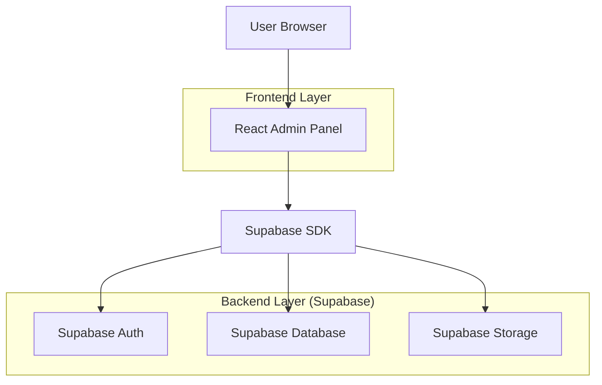
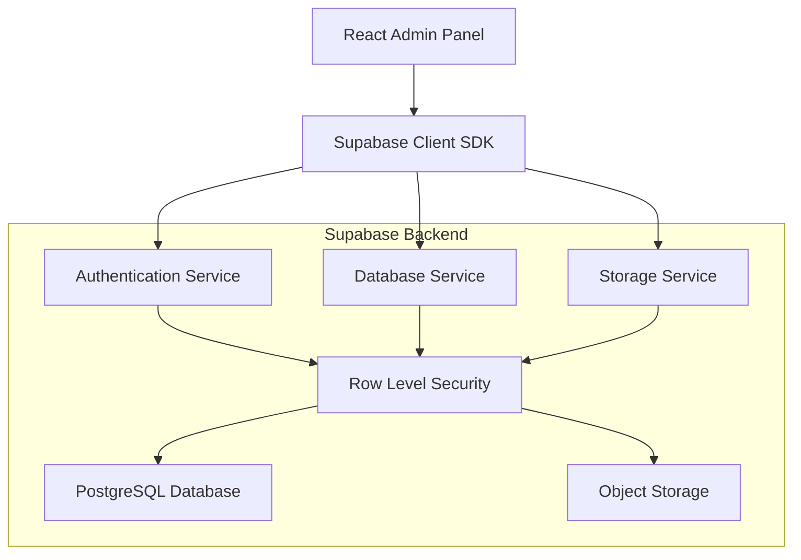
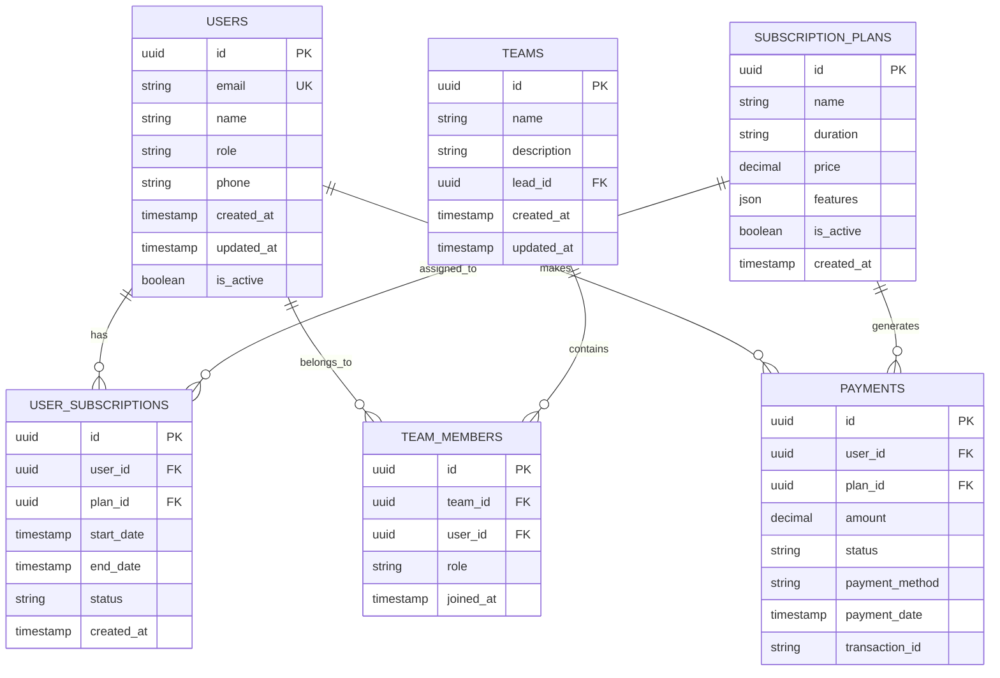

## 1. Architecture design



## 2. Technology Description

- Frontend: React@18 + tailwindcss@3 + vite
- Initialization Tool: vite-init
- Backend: Supabase (Auth + PostgreSQL + Storage)
- UI Components: Material-UI@5 + React Icons
- State Management: React Context API + useReducer
- Form Validation: React Hook Form + Yup
- Charts: Chart.js + React Chart.js 2

## 3. Route definitions

| Route | Purpose |
|-------|---------|
| /login | Admin authentication page |
| /dashboard | Main dashboard with overview statistics |
| /users | User management list page |
| /users/:id | Individual user profile details |
| /users/create | Create new user form |
| /teams | Team management list page |
| /teams/:id | Team details and member management |
| /teams/create | Create new team form |
| /subscriptions | Subscription plans and user subscriptions |
| /payments | Payment history and transaction tracking |
| /reports | Analytics and reporting dashboard |
| /settings | Admin panel settings and preferences |

## 4. API definitions

### 4.1 Authentication APIs

```
POST /auth/login
```

Request:
| Param Name | Param Type | isRequired | Description |
|------------|------------|------------|-------------|
| email | string | true | Admin email address |
| password | string | true | Admin password |

Response:
| Param Name | Param Type | Description |
|------------|------------|-------------|
| user | object | User data including role |
| session | object | Authentication session token |
| access_token | string | JWT access token |

### 4.2 User Management APIs

```
GET /api/users
```

Query Parameters:
| Param Name | Param Type | Description |
|------------|------------|-------------|
| page | number | Page number for pagination |
| limit | number | Items per page |
| search | string | Search term for filtering |
| status | string | Filter by user status |

```
POST /api/users
```

Request Body:
| Param Name | Param Type | isRequired | Description |
|------------|------------|------------|-------------|
| email | string | true | User email address |
| name | string | true | User full name |
| phone | string | false | User phone number |
| role | string | true | User role assignment |

### 4.3 Team Management APIs

```
GET /api/teams
```

```
POST /api/teams
```

Request Body:
| Param Name | Param Type | isRequired | Description |
|------------|------------|------------|-------------|
| name | string | true | Team name |
| description | string | false | Team description |
| lead_id | string | true | Team leader user ID |
| member_ids | array | false | Array of member user IDs |

### 4.4 Subscription APIs

```
GET /api/subscriptions
```

```
POST /api/subscriptions/plans
```

Request Body:
| Param Name | Param Type | isRequired | Description |
|------------|------------|------------|-------------|
| name | string | true | Plan name |
| duration | string | true | monthly/quarterly/yearly |
| price | number | true | Plan price |
| features | array | false | Plan features list |

## 5. Server architecture diagram



## 6. Data model

### 6.1 Data model definition



### 6.2 Data Definition Language

Users Table (users)
```sql
-- create table
CREATE TABLE users (
    id UUID PRIMARY KEY DEFAULT gen_random_uuid(),
    email VARCHAR(255) UNIQUE NOT NULL,
    name VARCHAR(100) NOT NULL,
    role VARCHAR(50) NOT NULL DEFAULT 'user',
    phone VARCHAR(20),
    is_active BOOLEAN DEFAULT true,
    created_at TIMESTAMP WITH TIME ZONE DEFAULT NOW(),
    updated_at TIMESTAMP WITH TIME ZONE DEFAULT NOW()
);

-- create indexes
CREATE INDEX idx_users_email ON users(email);
CREATE INDEX idx_users_role ON users(role);
CREATE INDEX idx_users_created_at ON users(created_at DESC);

-- set up RLS
ALTER TABLE users ENABLE ROW LEVEL SECURITY;

-- grant permissions
GRANT SELECT ON users TO anon;
GRANT ALL PRIVILEGES ON users TO authenticated;
```

Teams Table (teams)
```sql
-- create table
CREATE TABLE teams (
    id UUID PRIMARY KEY DEFAULT gen_random_uuid(),
    name VARCHAR(100) NOT NULL,
    description TEXT,
    lead_id UUID REFERENCES users(id),
    created_at TIMESTAMP WITH TIME ZONE DEFAULT NOW(),
    updated_at TIMESTAMP WITH TIME ZONE DEFAULT NOW()
);

-- create indexes
CREATE INDEX idx_teams_lead_id ON teams(lead_id);
CREATE INDEX idx_teams_created_at ON teams(created_at DESC);
```

Team Members Table (team_members)
```sql
-- create table
CREATE TABLE team_members (
    id UUID PRIMARY KEY DEFAULT gen_random_uuid(),
    team_id UUID NOT NULL REFERENCES teams(id) ON DELETE CASCADE,
    user_id UUID NOT NULL REFERENCES users(id) ON DELETE CASCADE,
    role VARCHAR(50) DEFAULT 'member',
    joined_at TIMESTAMP WITH TIME ZONE DEFAULT NOW(),
    UNIQUE(team_id, user_id)
);

-- create indexes
CREATE INDEX idx_team_members_team_id ON team_members(team_id);
CREATE INDEX idx_team_members_user_id ON team_members(user_id);
```

Subscription Plans Table (subscription_plans)
```sql
-- create table
CREATE TABLE subscription_plans (
    id UUID PRIMARY KEY DEFAULT gen_random_uuid(),
    name VARCHAR(100) NOT NULL,
    duration VARCHAR(20) NOT NULL CHECK (duration IN ('monthly', 'quarterly', 'yearly')),
    price DECIMAL(10,2) NOT NULL,
    features JSONB DEFAULT '[]',
    is_active BOOLEAN DEFAULT true,
    created_at TIMESTAMP WITH TIME ZONE DEFAULT NOW()
);

-- create indexes
CREATE INDEX idx_subscription_plans_active ON subscription_plans(is_active);
```

User Subscriptions Table (user_subscriptions)
```sql
-- create table
CREATE TABLE user_subscriptions (
    id UUID PRIMARY KEY DEFAULT gen_random_uuid(),
    user_id UUID NOT NULL REFERENCES users(id) ON DELETE CASCADE,
    plan_id UUID NOT NULL REFERENCES subscription_plans(id),
    start_date TIMESTAMP WITH TIME ZONE NOT NULL,
    end_date TIMESTAMP WITH TIME ZONE NOT NULL,
    status VARCHAR(20) DEFAULT 'active' CHECK (status IN ('active', 'expired', 'cancelled')),
    created_at TIMESTAMP WITH TIME ZONE DEFAULT NOW()
);

-- create indexes
CREATE INDEX idx_user_subscriptions_user_id ON user_subscriptions(user_id);
CREATE INDEX idx_user_subscriptions_plan_id ON user_subscriptions(plan_id);
CREATE INDEX idx_user_subscriptions_status ON user_subscriptions(status);
```

Payments Table (payments)
```sql
-- create table
CREATE TABLE payments (
    id UUID PRIMARY KEY DEFAULT gen_random_uuid(),
    user_id UUID NOT NULL REFERENCES users(id),
    plan_id UUID NOT NULL REFERENCES subscription_plans(id),
    amount DECIMAL(10,2) NOT NULL,
    status VARCHAR(20) NOT NULL CHECK (status IN ('pending', 'completed', 'failed', 'refunded')),
    payment_method VARCHAR(50),
    payment_date TIMESTAMP WITH TIME ZONE DEFAULT NOW(),
    transaction_id VARCHAR(100),
    created_at TIMESTAMP WITH TIME ZONE DEFAULT NOW()
);

-- create indexes
CREATE INDEX idx_payments_user_id ON payments(user_id);
CREATE INDEX idx_payments_plan_id ON payments(plan_id);
CREATE INDEX idx_payments_status ON payments(status);
CREATE INDEX idx_payments_created_at ON payments(created_at DESC);
```

### 6.3 Initial Data

```sql
-- Insert default subscription plans
INSERT INTO subscription_plans (name, duration, price, features) VALUES
('Monthly Basic', 'monthly', 29.99, '["Basic features", "Email support", "5GB storage"]'),
('Quarterly Pro', 'quarterly', 79.99, '["Pro features", "Priority support", "50GB storage", "Advanced analytics"]'),
('Yearly Enterprise', 'yearly', 299.99, '["Enterprise features", "24/7 support", "Unlimited storage", "Custom integrations", "API access"]');

-- Insert sample admin user
INSERT INTO users (email, name, role, is_active) VALUES
('admin@adminpanel.com', 'System Administrator', 'admin', true);
```