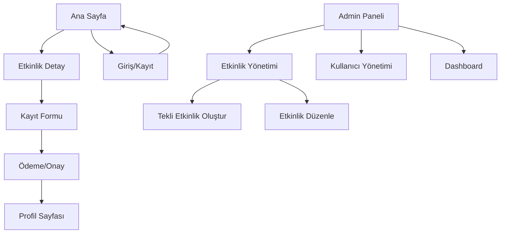

## 1. Product Overview

Modern ve kullanıcı dostu bir etkinlik yönetim platformu. Admin paneli ile tekli etkinlikler oluşturabilme, düzenleyebilme ve yönetebilme özellikleri sunar.

Kullanıcılar etkinlikleri görüntüleyebilir, kayıt olabilir ve etkinlik detaylarını inceleyebilir. Admin kullanıcılar tüm etkinlikleri yönetebilir, yeni etkinlikler oluşturabilir ve mevcut etkinlikleri düzenleyebilir.

## 2. Core Features

### 2.1 User Roles

| Role | Registration Method | Core Permissions |
|------|---------------------|------------------|
| Normal User | Email ile kayıt | Etkinlikleri görüntüleme, etkinliklere kayıt olma, profil yönetimi |
| Admin User | Admin panelinden oluşturulur | Tüm etkinlik CRUD işlemleri, kullanıcı yönetimi, sistem ayarları |

### 2.2 Feature Module

Etkinlik yönetim sistemi aşağıdaki temel sayfalardan oluşur:

1. **Ana Sayfa**: Hero bölümü, etkinlik listesi, navigation, arama ve filtreleme
2. **Etkinlik Detay Sayfası**: Etkinlik bilgileri, kayıt formu, konum bilgileri
3. **Kullanıcı Profil Sayfası**: Kişisel bilgiler, katıldığı etkinlikler, ayarlar
4. **Giriş/Kayıt Sayfası**: Kullanıcı girişi ve yeni kullanıcı kaydı
5. **Admin Paneli**: Etkinlik CRUD işlemleri, kullanıcı yönetimi, dashboard

### 2.3 Page Details

| Page Name | Module Name | Feature description |
|-----------|-------------|---------------------|
| Ana Sayfa | Hero Section | Modern tasarımlı hero banner, etkinlik arama çubuğu, animasyonlu geçişler |
| Ana Sayfa | Etkinlik Listesi | Kart tabanlı etkinlik gösterimi, kategori filtreleme, tarih sıralaması, pagination |
| Ana Sayfa | Navigation | Responsive navigation bar, kullanıcı giriş durumu göstergesi, admin paneli erişimi |
| Etkinlik Detay | Bilgi Bölümü | Etkinlik adı, tarih, saat, konum, açıklama, kontenjan bilgileri |
| Etkinlik Detay | Kayıt Formu | Kullanıcı bilgileri formu, katılım onayı, email doğrulama |
| Etkinlik Detay | Harita Entegrasyonu | Konum gösterimi, yol tarifi, Google Maps entegrasyonu |
| Kullanıcı Profil | Kişisel Bilgiler | Ad, soyad, email, telefon bilgileri düzenleme |
| Kullanıcı Profil | Etkinlik Geçmişi | Katıldığı etkinlikler listesi, katılım durumu |
| Giriş/Kayıt | Giriş Formu | Email ve şifre ile giriş, şifremi unuttum özelliği |
| Giriş/Kayıt | Kayıt Formu | Email doğrulama, güçlü şifre kontrolü, kullanıcı sözleşmesi |
| Admin Paneli | Dashboard | Toplam etkinlik sayısı, kullanıcı istatistikleri, grafikler |
| Admin Paneli | Etkinlik Yönetimi | Yeni etkinlik oluşturma, düzenleme, silme, yayın durumu yönetimi |
| Admin Paneli | Kullanıcı Yönetimi | Kullanıcı listesi, rol atama, kullanıcı durumu yönetimi |
| Admin Paneli | Tekli Etkinlikler | Özel etkinlik oluşturma, sadece davetli kullanıcılar için erişim |

## 3. Core Process

### Normal Kullanıcı Akışı:
1. Ana sayfaya gelir ve etkinlikleri görüntüler
2. Arama ve filtreleme özelliklerini kullanarak ilgilendiği etkinlikleri bulur
3. Etkinlik detay sayfasını açarak bilgileri inceler
4. Kayıt olmak için formu doldurur
5. Email doğrulaması yaparak kaydını tamamlar
6. Profil sayfasından katıldığı etkinlikleri görüntüler

### Admin Kullanıcı Akışı:
1. Admin paneline giriş yapar
2. Dashboard üzerinden genel istatistikleri görüntüler
3. Yeni etkinlik oluşturur veya mevcut etkinlikleri düzenler
4. Tekli özel etkinlikler oluşturur
5. Kullanıcı yönetimini gerçekleştirir
6. Etkinlik katılımcılarını yönetir

## 4. User Interface Design

### 4.1 Design Style

- **Primary Color**: #2563eb (Modern mavi tonu)
- **Secondary Color**: #64748b (Gri tonları)
- **Accent Color**: #f59e0b (Sarı vurgu rengi)
- **Button Style**: Yuvarlatılmış köşeler, hover animasyonları
- **Font**: Inter (Modern sans-serif)
- **Font Sizes**: Başlıklar 2rem, içerik 1rem, küçük metin 0.875rem
- **Layout Style**: Kart tabanlı tasarım, grid sistemi
- **Icon Style**: Material Design ikonları, React Icons kütüphanesi

### 4.2 Page Design Overview

| Page Name | Module Name | UI Elements |
|-----------|-------------|-------------|
| Ana Sayfa | Hero Section | Tam ekran genişliğinde banner, parallax efekt, CTA butonları, arama çubuğu overlay |
| Ana Sayfa | Etkinlik Kartları | 3 sütun grid layout, hover efektleri, kategori badge'leri, tarih göstergesi, kayıt butonu |
| Ana Sayfa | Navigation | Sticky header, logo solda, menü ortada, kullanıcı butonu sağda, mobile hamburger menu |
| Etkinlik Detay | Header | Büyük etkinlik görseli, başlık, tarih bilgisi, breadcrumb navigation |
| Etkinlik Detay | İçerik | 2 sütun layout, solda detay bilgiler, sağda kayıt formu ve harita |
| Admin Paneli | Sidebar | Sol tarafta sabit menu, ikonlar + metin, active state göstergesi |
| Admin Paneli | İçerik Alanı | Sağ tarafta değişken içerik, tablolar, formlar, modal'lar |

### 4.3 Responsiveness

- **Desktop-First**: Tasarım masaüstü için optimize edilmiştir
- **Mobile Adaptation**: 768px ve altında tek sütun layout
- **Touch Optimization**: Mobil cihazlar için büyük tıklama alanları, swipe gesture desteği
- **Tablet Support**: 768px-1024px arası responsive grid sistemi