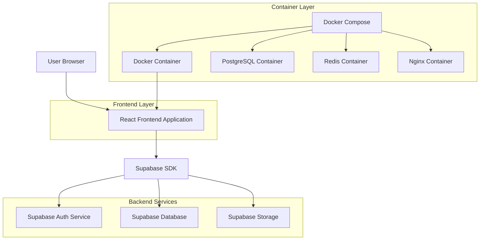
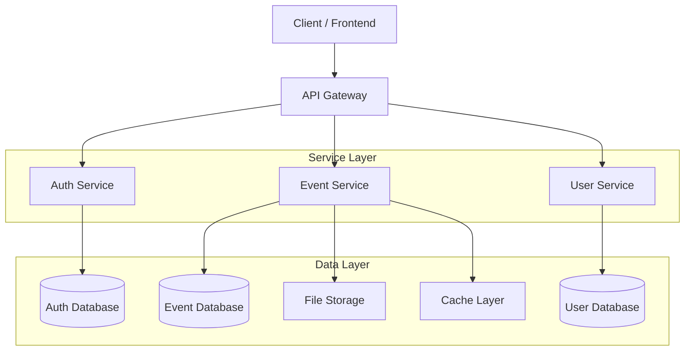
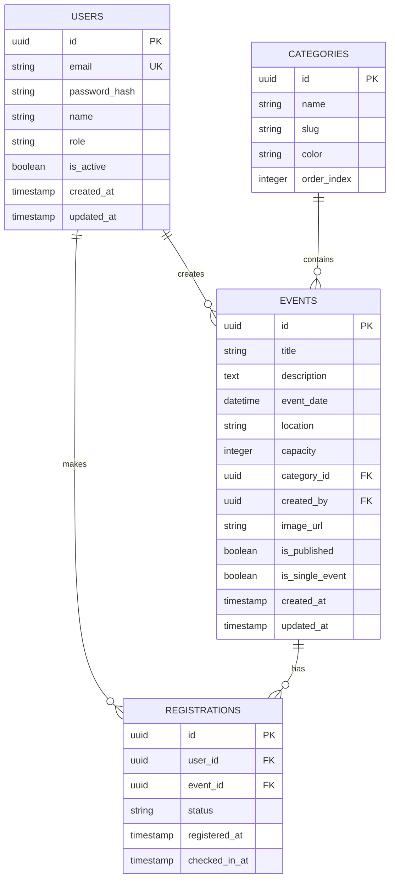

## 1. Architecture design



## 2. Technology Description

- **Frontend**: React@18 + tailwindcss@3 + vite
- **Initialization Tool**: vite-init
- **Backend**: Supabase (PostgreSQL + Authentication + Storage)
- **Container**: Docker + Docker Compose
- **State Management**: React Context API + useReducer
- **UI Components**: Material-UI + React Icons
- **Form Validation**: React Hook Form + Yup
- **HTTP Client**: Axios
- **Date Management**: date-fns
- **Map Integration**: Google Maps API

## 3. Route definitions

| Route | Purpose |
|-------|---------|
| / | Ana sayfa, etkinlik listesi ve hero bölümü |
| /events/:id | Etkinlik detay sayfası |
| /login | Kullanıcı giriş sayfası |
| /register | Kullanıcı kayıt sayfası |
| /profile | Kullanıcı profil sayfası |
| /admin | Admin dashboard sayfası |
| /admin/events | Etkinlik yönetim paneli |
| /admin/events/new | Yeni etkinlik oluşturma |
| /admin/events/:id/edit | Etkinlik düzenleme |
| /admin/users | Kullanıcı yönetim paneli |
| /admin/single-events | Tekli etkinlik yönetimi |

## 4. API definitions

### 4.1 Authentication APIs

```
POST /api/auth/login
```

Request:
| Param Name | Param Type | isRequired | Description |
|------------|------------|------------|-------------|
| email | string | true | Kullanıcı email adresi |
| password | string | true | Kullanıcı şifresi |

Response:
| Param Name | Param Type | Description |
|------------|------------|-------------|
| user | object | Kullanıcı bilgileri |
| session | object | Oturum bilgileri |
| access_token | string | Erişim token'ı |

### 4.2 Event APIs

```
GET /api/events
```

Request Query Parameters:
| Param Name | Param Type | isRequired | Description |
|------------|------------|------------|-------------|
| page | number | false | Sayfa numarası (default: 1) |
| limit | number | false | Sayfa başına sonuç (default: 10) |
| category | string | false | Kategori filtresi |
| date_from | string | false | Başlangıç tarihi |
| date_to | string | false | Bitiş tarihi |

```
POST /api/events
```

Request:
| Param Name | Param Type | isRequired | Description |
|------------|------------|------------|-------------|
| title | string | true | Etkinlik başlığı |
| description | string | true | Etkinlik açıklaması |
| date | string | true | Etkinlik tarihi |
| time | string | true | Etkinlik saati |
| location | string | true | Etkinlik konumu |
| capacity | number | true | Kontenjan bilgisi |
| category | string | true | Etkinlik kategorisi |
| image_url | string | false | Etkinlik görseli |

### 4.3 Registration APIs

```
POST /api/events/:id/register
```

Request:
| Param Name | Param Type | isRequired | Description |
|------------|------------|------------|-------------|
| user_id | string | true | Kullanıcı ID |
| name | string | true | Katılımcı adı |
| email | string | true | Katılımcı email |
| phone | string | false | Katılımcı telefon |

## 5. Server architecture diagram



## 6. Data model

### 6.1 Data model definition



### 6.2 Data Definition Language

**Users Table**
```sql
-- create table
CREATE TABLE users (
    id UUID PRIMARY KEY DEFAULT gen_random_uuid(),
    email VARCHAR(255) UNIQUE NOT NULL,
    password_hash VARCHAR(255) NOT NULL,
    name VARCHAR(100) NOT NULL,
    role VARCHAR(20) DEFAULT 'user' CHECK (role IN ('user', 'admin')),
    is_active BOOLEAN DEFAULT true,
    created_at TIMESTAMP WITH TIME ZONE DEFAULT NOW(),
    updated_at TIMESTAMP WITH TIME ZONE DEFAULT NOW()
);

-- create indexes
CREATE INDEX idx_users_email ON users(email);
CREATE INDEX idx_users_role ON users(role);
```

**Events Table**
```sql
-- create table
CREATE TABLE events (
    id UUID PRIMARY KEY DEFAULT gen_random_uuid(),
    title VARCHAR(255) NOT NULL,
    description TEXT,
    event_date TIMESTAMP WITH TIME ZONE NOT NULL,
    location VARCHAR(255) NOT NULL,
    capacity INTEGER NOT NULL CHECK (capacity > 0),
    category_id UUID REFERENCES categories(id),
    created_by UUID REFERENCES users(id),
    image_url VARCHAR(500),
    is_published BOOLEAN DEFAULT false,
    is_single_event BOOLEAN DEFAULT false,
    created_at TIMESTAMP WITH TIME ZONE DEFAULT NOW(),
    updated_at TIMESTAMP WITH TIME ZONE DEFAULT NOW()
);

-- create indexes
CREATE INDEX idx_events_date ON events(event_date);
CREATE INDEX idx_events_published ON events(is_published);
CREATE INDEX idx_events_single ON events(is_single_event);
```

**Registrations Table**
```sql
-- create table
CREATE TABLE registrations (
    id UUID PRIMARY KEY DEFAULT gen_random_uuid(),
    user_id UUID REFERENCES users(id) ON DELETE CASCADE,
    event_id UUID REFERENCES events(id) ON DELETE CASCADE,
    status VARCHAR(20) DEFAULT 'pending' CHECK (status IN ('pending', 'confirmed', 'cancelled')),
    registered_at TIMESTAMP WITH TIME ZONE DEFAULT NOW(),
    checked_in_at TIMESTAMP WITH TIME ZONE,
    UNIQUE(user_id, event_id)
);

-- create indexes
CREATE INDEX idx_registrations_user ON registrations(user_id);
CREATE INDEX idx_registrations_event ON registrations(event_id);
CREATE INDEX idx_registrations_status ON registrations(status);
```

**Categories Table**
```sql
-- create table
CREATE TABLE categories (
    id UUID PRIMARY KEY DEFAULT gen_random_uuid(),
    name VARCHAR(100) NOT NULL,
    slug VARCHAR(100) UNIQUE NOT NULL,
    color VARCHAR(7) DEFAULT '#2563eb',
    order_index INTEGER DEFAULT 0,
    created_at TIMESTAMP WITH TIME ZONE DEFAULT NOW()
);

-- insert default categories
INSERT INTO categories (name, slug, color, order_index) VALUES
('Konferans', 'konferans', '#2563eb', 1),
('Workshop', 'workshop', '#f59e0b', 2),
('Seminer', 'seminer', '#10b981', 3),
('Sosyal Etkinlik', 'sosyal', '#ef4444', 4);
```

### 6.3 Supabase Row Level Security Policies

```sql
-- Enable RLS
ALTER TABLE events ENABLE ROW LEVEL SECURITY;
ALTER TABLE registrations ENABLE ROW LEVEL SECURITY;
ALTER TABLE users ENABLE ROW LEVEL SECURITY;

-- Events policies
CREATE POLICY "Herkes yayınlanmış etkinlikleri görebilir" ON events
    FOR SELECT USING (is_published = true);

CREATE POLICY "Sadece adminler etkinlik oluşturabilir" ON events
    FOR INSERT WITH CHECK (auth.uid() IN (SELECT id FROM users WHERE role = 'admin'));

CREATE POLICY "Sadece adminler etkinlik düzenleyebilir" ON events
    FOR UPDATE USING (auth.uid() IN (SELECT id FROM users WHERE role = 'admin'));

-- Registrations policies
CREATE POLICY "Kullanıcılar kendi kayıtlarını görebilir" ON registrations
    FOR SELECT USING (user_id = auth.uid());

CREATE POLICY "Kullanıcılar etkinliğe kayıt olabilir" ON registrations
    FOR INSERT WITH CHECK (user_id = auth.uid());

-- Users policies
CREATE POLICY "Kullanıcılar kendi profilini görebilir" ON users
    FOR SELECT USING (id = auth.uid());

CREATE POLICY "Kullanıcılar kendi profilini güncelleyebilir" ON users
    FOR UPDATE USING (id = auth.uid());
```

## 7. Docker Configuration

### 7.1 Dockerfile

```dockerfile
# Frontend Dockerfile
FROM node:18-alpine AS builder
WORKDIR /app
COPY package*.json ./
RUN npm ci --only=production
COPY . .
RUN npm run build

FROM nginx:alpine
COPY --from=builder /app/dist /usr/share/nginx/html
COPY nginx.conf /etc/nginx/nginx.conf
EXPOSE 80
CMD ["nginx", "-g", "daemon off;"]
```

### 7.2 Docker Compose Configuration

```yaml
version: '3.8'
services:
  frontend:
    build: .
    ports:
      - "3000:80"
    depends_on:
      - backend
    environment:
      - REACT_APP_API_URL=http://backend:8000
      - REACT_APP_SUPABASE_URL=${SUPABASE_URL}
      - REACT_APP_SUPABASE_ANON_KEY=${SUPABASE_ANON_KEY}

  backend:
    image: supabase/supabase:latest
    ports:
      - "8000:8000"
    environment:
      - SUPABASE_URL=${SUPABASE_URL}
      - SUPABASE_SERVICE_KEY=${SUPABASE_SERVICE_KEY}
    volumes:
      - ./backend:/app
      - /app/node_modules

  nginx:
    image: nginx:alpine
    ports:
      - "80:80"
      - "443:443"
    volumes:
      - ./nginx.conf:/etc/nginx/nginx.conf
      - ./ssl:/etc/nginx/ssl
    depends_on:
      - frontend
      - backend

  redis:
    image: redis:alpine
    ports:
      - "6379:6379"
    volumes:
      - redis_data:/data

volumes:
  redis_data:
```