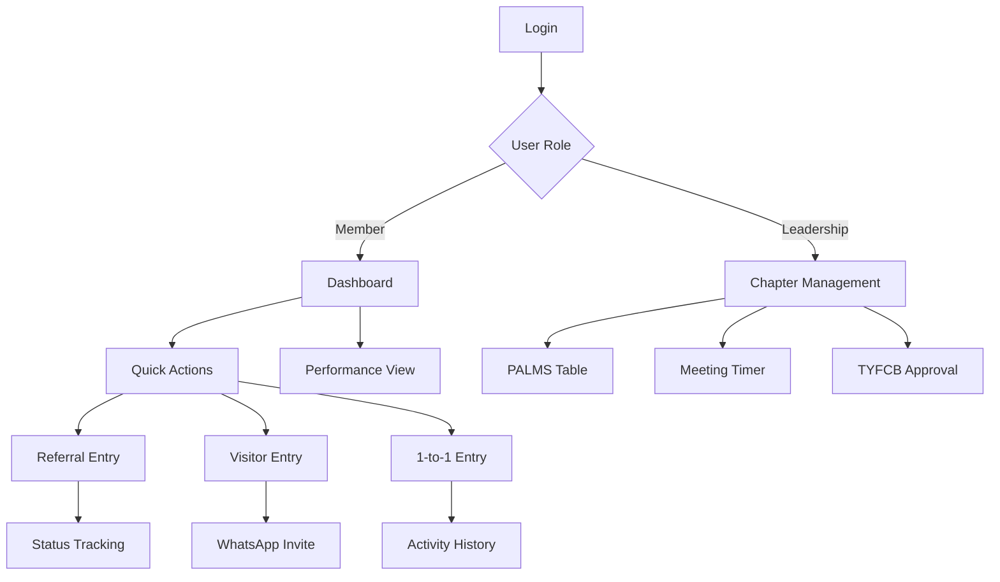

## 1. Product Overview

Event 4 Network, BNI (Business Network International) modelini temel alan profesyonel networking yönetim platformudur. Üyelerin iş yönlendirmelerini, toplantı katılımlarını ve performanslarını takip etmelerini sağlar.

Platform, BNI'nin PALMS raporlama sistemi, trafik ışıkları performans göstergeleri ve iş yönlendirme mekanizmalarını dijitalleştirir. Amacı, networking etkinliklerini daha verimli ve ölçülebilir hale getirmektir.

## 2. Core Features

### 2.1 User Roles

| Role | Registration Method | Core Permissions |
|------|-------------------|------------------|
| Member | Email + Chapter invitation | Referral girişi, 1-to-1 kaydı, CEU girişi, kendi performans görüntüleme |
| President | Admin assignment | Tüm chapter verilerini görüntüleme, üye yönetimi, toplantı kontrolü |
| Vice President | President assignment | Chapter raporları, üye performans takibi, toplantı yönetimi |
| Secretary Treasurer | President assignment | Finansal raporlar, TYFCB giriş onayı, devamsızlık takibi |

### 2.2 Feature Module

Event 4 Network aşağıdaki ana sayfalardan oluşur:

1. **Dashboard**: Üye performans göstergeleri, trafik ışığı durumu, eksik aktiviteler
2. **Chapter Management**: Liderlik ekibi için PALMS raporu, toplantı sayacı, üye durumları
3. **Referral System**: İş yönlendirme girişi, takip ve durum güncelleme
4. **Activity Entry**: 1-to-1 görüşmeler, ziyaretçi kaydı, CEU girişi
5. **Reports**: TYFCB raporları, bireysel ve chapter bazlı analizler
6. **Meeting Timer**: Toplantı sırasında 60 saniye konuşma süresi yönetimi

### 2.3 Page Details

| Page Name | Module Name | Feature description |
|-----------|-------------|---------------------|
| Dashboard | Traffic Light Card | Üyenin mevcut puanını ve rengini göster, eksik aktiviteleri listele |
| Dashboard | Quick Actions | Hızlı referral girişi, ziyaretçi kaydı, 1-to-1 girişi butonları |
| Chapter Management | PALMS Table | Üyelerin katılım durumu (Present/Absent/Late/Medical/Substitute) |
| Chapter Management | Referral Count | Her üyenin verdiği iş yönlendirme sayısı |
| Chapter Management | Visitor Count | Üyelerin getirdiği ziyaretçi sayısı |
| Chapter Management | TYFCB Amount | Üyelerin kazandırdığı toplam iş hacmi |
| Chapter Management | Meeting Timer | 60 saniye geri sayım, üye sırası yönetimi |
| Referral System | Referral Form | Alıcı üye seçimi, tip (internal/external), sıcaklık (hot/warm/cold) |
| Referral System | Status Tracking | Referral durumu güncelleme (pending/successful/unsuccessful) |
| Activity Entry | 1-to-1 Form | Görüşülen üye, konu, tarih ve notlar |
| Activity Entry | Visitor Form | Ziyaretçi bilgileri, meslek, iletişim, davet eden üye |
| Activity Entry | CEU Form | Eğitim türü, süresi, tarih ve açıklama |
| Reports | TYFCB Report | Aylık/yıllık iş hacmi, en çok kazandıran üyeler |
| Reports | Performance Analytics | Trafik ışığı geçmişi, trend analizleri |

## 3. Core Process

### Member Flow
1. Üye dashboard'a giriş yapar
2. Trafik ışığı puanını ve eksik aktivitelerini görür
3. Hızlı aksiyon butonları ile referral, ziyaretçi veya 1-to-1 girişi yapar
4. TYFCB girişi için Secretary Treasurer onayı bekler
5. Performans raporlarını görüntüler

### Leadership Team Flow
1. Chapter Management sayfasını açar
2. PALMS tablosundan tüm üyelerin durumunu kontrol eder
3. Toplantı sırasında timer'ı yönetir
4. TYFCB girişlerini onaylar/reddeder
5. Chapter performans raporlarını analiz eder

## 4. User Interface Design

### 4.1 Design Style
- **Primary Colors**: BNI'nin kurumsal renkleri (Kırmızı #DC143C, Siyah #000000, Beyaz #FFFFFF)
- **Secondary Colors**: Trafik ışıkları (Yeşil #28a745, Sarı #ffc107, Kırmızı #dc3545, Gri #6c757d)
- **Button Style**: Modern rounded corners, hover efektleri, ikon destekli
- **Font**: Modern sans-serif (Inter, Roboto), 14-16px temel boyut
- **Layout**: Card-based design, responsive grid sistemi
- **Icons**: Material Design ikon seti, anlamlı renk kodlamaları

### 4.2 Page Design Overview

| Page Name | Module Name | UI Elements |
|-----------|-------------|-------------|
| Dashboard | Traffic Light Card | Büyük yuvarlak puan göstergesi, renkli arka plan, başarı ibaresi |
| Dashboard | Quick Actions | Renkli ikonlu butonlar, hover animasyonları, tooltip desteği |
| Chapter Management | PALMS Table | Satır bazlı renklendirme, sıralama ikonları, filtre butonları |
| Chapter Management | Meeting Timer | Dev sayı göstergesi, progress bar, sesli uyarı |
| Referral System | Entry Forms | Sekmeli yapı, dropdown menüler, validation mesajları |
| Activity Entry | Input Forms | Date picker, text alanları, success/error feedback |
| Reports | Charts | Bar/line grafikler, renkli göstergeler, export butonları |

### 4.3 Responsiveness
- Desktop-first yaklaşım, minimum 1200px genişlik
- Tablet: 768px-1199px arası uyumlu grid sistemi
- Mobile: 320px-767px arası stack layout, touch-friendly butonlar
- Meeting Timer için büyük ekran optimizasyonu (projeksiyon deste