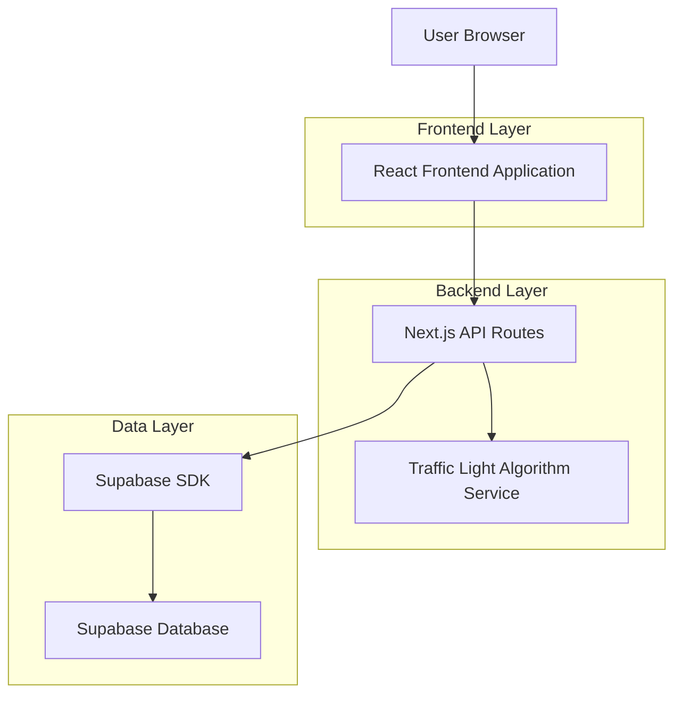
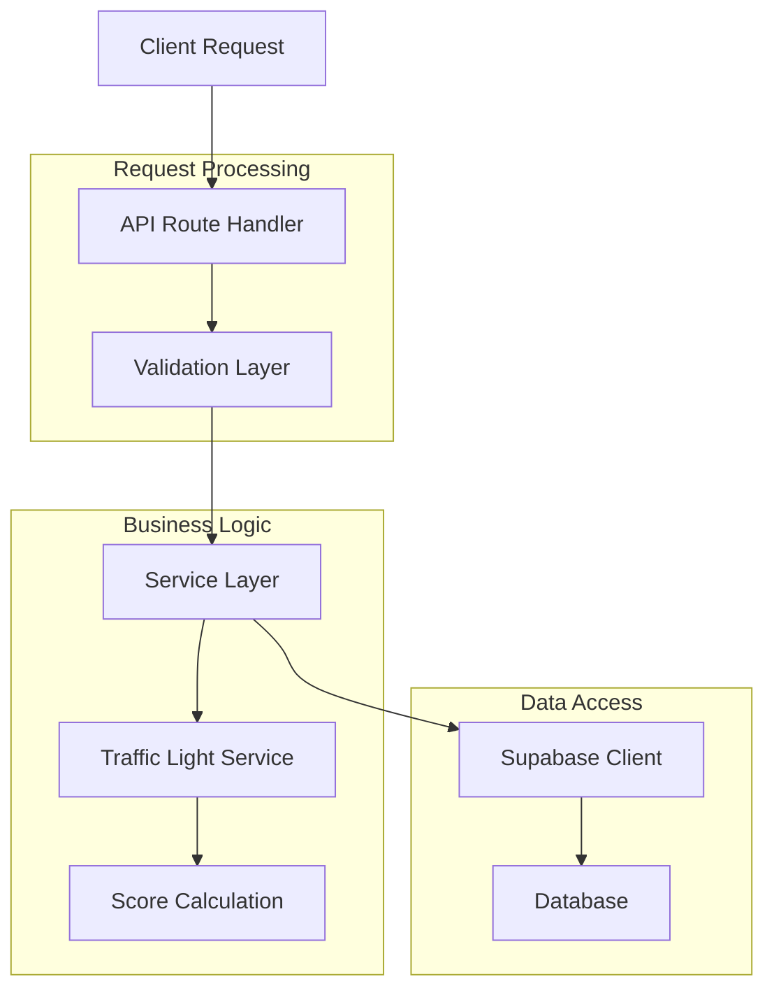
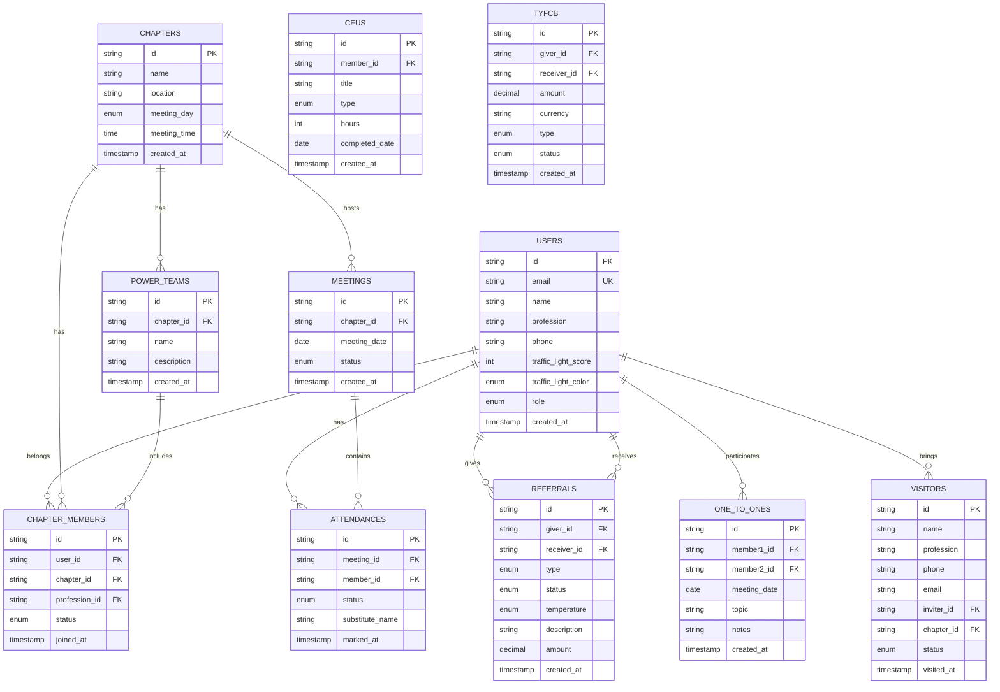

## 1. Architecture Design



## 2. Technology Description

- **Frontend**: React@18 + TypeScript + Vite + TailwindCSS@3
- **UI Components**: Shadcn/ui + Radix UI + Lucide React Icons
- **Initialization Tool**: vite-init
- **Backend**: Next.js API Routes + Supabase SDK
- **Database**: Supabase (PostgreSQL) + Prisma ORM
- **Mobile**: React Native + Expo
- **State Management**: React Context + Zustand
- **Form Validation**: React Hook Form + Zod
- **Charts**: Recharts for analytics dashboard

## 3. Route Definitions

| Route | Purpose |
|-------|---------|
| / | Dashboard - Üye ana ekranı ve trafik ışığı gösterimi |
| /chapter-management | Liderlik ekibi için PALMS raporu ve toplantı yönetimi |
| /referrals | İş yönlendirme girişi ve takip sayfası |
| /activities | 1-to-1, ziyaretçi ve CEU giriş formları |
| /reports | TYFCB ve performans analiz raporları |
| /meeting-timer | Toplantı sırasında 60 saniye sayaç ekranı |
| /profile | Kullanıcı profil ve ayarlar sayfası |
| /auth/login | Giriş sayfası |
| /auth/register | Üyelik kayıt sayfası |

## 4. API Definitions

### 4.1 Authentication APIs

```
POST /api/auth/login
```

Request:
| Param Name | Param Type | isRequired | Description |
|------------|------------|------------|-------------|
| email | string | true | Kullanıcı e-posta adresi |
| password | string | true | Şifre |

Response:
| Param Name | Param Type | Description |
|------------|------------|-------------|
| user | object | Kullanıcı bilgileri ve rolü |
| token | string | JWT token |
| chapterId | string | Üyenin bağlı olduğu chapter ID |

### 4.2 Referral APIs

```
POST /api/referrals/create
```

Request:
| Param Name | Param Type | isRequired | Description |
|------------|------------|------------|-------------|
| giverId | string | true | Yönlendiren üye ID |
| receiverId | string | true | Yönlendirilen üye ID |
| type | enum | true | INTERNAL/EXTERNAL |
| temperature | enum | true | HOT/WARM/COLD |
| description | string | true | İş açıklaması |
| status | enum | false | PENDING/SUCCESSFUL/UNSUCCESSFUL |

### 4.3 Traffic Light API

```
GET /api/members/{memberId}/traffic-light
```

Response:
| Param Name | Param Type | Description |
|------------|------------|-------------|
| score | number | 0-100 arası puan |
| color | enum | GREEN/YELLOW/RED/GREY |
| breakdown | object | Her kategorideki puan detayı |
| recommendations | array | Puan artırmak için öneriler |

### 4.4 PALMS Report API

```
GET /api/chapters/{chapterId}/palms-report
```

Response:
| Param Name | Param Type | Description |
|------------|------------|-------------|
| members | array | Üye listesi ve PALMS durumları |
| meetingDate | date | Toplantı tarihi |
| summary | object | Genel katılım oranı ve istatistikler |

## 5. Server Architecture Diagram



## 6. Data Model

### 6.1 Database Schema



### 6.2 Data Definition Language

```sql
-- Users table
CREATE TABLE users (
    id UUID PRIMARY KEY DEFAULT gen_random_uuid(),
    email VARCHAR(255) UNIQUE NOT NULL,
    name VARCHAR(100) NOT NULL,
    profession VARCHAR(100),
    phone VARCHAR(20),
    password_hash VARCHAR(255) NOT NULL,
    traffic_light_score INTEGER DEFAULT 0 CHECK (traffic_light_score >= 0 AND traffic_light_score <= 100),
    traffic_light_color VARCHAR(10) DEFAULT 'GREY' CHECK (traffic_light_color IN ('GREEN', 'YELLOW', 'RED', 'GREY')),
    role VARCHAR(20) DEFAULT 'MEMBER' CHECK (role IN ('MEMBER', 'PRESIDENT', 'VICE_PRESIDENT', 'SECRETARY_TREASURER')),
    created_at TIMESTAMP WITH TIME ZONE DEFAULT NOW(),
    updated_at TIMESTAMP WITH TIME ZONE DEFAULT NOW()
);

-- Chapters table
CREATE TABLE chapters (
    id UUID PRIMARY KEY DEFAULT gen_random_uuid(),
    name VARCHAR(255) NOT NULL,
    location VARCHAR(255),
    meeting_day VARCHAR(10) CHECK (meeting_day IN ('MONDAY', 'TUESDAY', 'WEDNESDAY', 'THURSDAY', 'FRIDAY')),
    meeting_time TIME,
    created_at TIMESTAMP WITH TIME ZONE DEFAULT NOW()
);

-- Chapter members junction table
CREATE TABLE chapter_members (
    id UUID PRIMARY KEY DEFAULT gen_random_uuid(),
    user_id UUID REFERENCES users(id) ON DELETE CASCADE,
    chapter_id UUID REFERENCES chapters(id) ON DELETE CASCADE,
    profession_id VARCHAR(100),
    status VARCHAR(20) DEFAULT 'ACTIVE' CHECK (status IN ('ACTIVE', 'INACTIVE', 'SUSPENDED')),
    joined_at TIMESTAMP WITH TIME ZONE DEFAULT NOW(),
    UNIQUE(user_id, chapter_id, profession_id)
);

-- Referrals table
CREATE TABLE referrals (
    id UUID PRIMARY KEY DEFAULT gen_random_uuid(),
    giver_id UUID REFERENCES users(id) ON DELETE CASCADE,
    receiver_id UUID REFERENCES users(id) ON DELETE CASCADE,
    type VARCHAR(10) CHECK (type IN ('INTERNAL', 'EXTERNAL')),
    status VARCHAR(15) DEFAULT 'PENDING' CHECK (status IN ('PENDING', 'SUCCESSFUL', 'UNSUCCESSFUL')),
    temperature VARCHAR(10) CHECK (temperature IN ('HOT', 'WARM', 'COLD')),
    description TEXT,
    amount DECIMAL(10, 2),
    created_at TIMESTAMP WITH TIME ZONE DEFAULT NOW(),
    updated_at TIMESTAMP WITH TIME ZONE DEFAULT NOW()
);

-- Meetings table
CREATE TABLE meetings (
    id UUID PRIMARY KEY DEFAULT gen_random_uuid(),
    chapter_id UUID REFERENCES chapters(id) ON DELETE CASCADE,
    meeting_date DATE NOT NULL,
    status VARCHAR(20) DEFAULT 'SCHEDULED' CHECK (status IN ('SCHEDULED', 'COMPLETED', 'CANCELLED')),
    created_at TIMESTAMP WITH TIME ZONE DEFAULT NOW()
);

-- Attendance table
CREATE TABLE attendances (
    id UUID PRIMARY KEY DEFAULT gen_random_uuid(),
    meeting_id UUID REFERENCES meetings(id) ON DELETE CASCADE,
    member_id UUID REFERENCES users(id) ON DELETE CASCADE,
    status VARCHAR(15) CHECK (status IN ('PRESENT', 'ABSENT', 'LATE', 'MEDICAL', 'SUBSTITUTE')),
    substitute_name VARCHAR(100),
    marked_at TIMESTAMP WITH TIME ZONE DEFAULT NOW(),
    UNIQUE(meeting_id, member_id)
);

-- One-to-one meetings
CREATE TABLE one_to_ones (
    id UUID PRIMARY KEY DEFAULT gen_random_uuid(),
    member1_id UUID REFERENCES users(id) ON DELETE CASCADE,
    member2_id UUID REFERENCES users(id) ON DELETE CASCADE,
    meeting_date DATE NOT NULL,
    topic VARCHAR(255),
    notes TEXT,
    created_at TIMESTAMP WITH TIME ZONE DEFAULT NOW()
);

-- Visitors table
CREATE TABLE visitors (
    id UUID PRIMARY KEY DEFAULT gen_random_uuid(),
    name VARCHAR(100) NOT NULL,
    profession VARCHAR(100),
    phone VARCHAR(20),
    email VARCHAR(255),
    inviter_id UUID REFERENCES users(id) ON DELETE CASCADE,
    chapter_id UUID REFERENCES chapters(id) ON DELETE CASCADE,
    status VARCHAR(20) DEFAULT 'INVITED' CHECK (status IN ('INVITED', 'ATTENDED', 'JOINED', 'DECLINED')),
    visited_at TIMESTAMP WITH TIME ZONE DEFAULT NOW()
);

-- Power teams
CREATE TABLE power_teams (
    id UUID PRIMARY KEY DEFAULT gen_random_uuid(),
    chapter_id UUID REFERENCES chapters(id) ON DELETE CASCADE,
    name VARCHAR(255) NOT NULL,
    description TEXT,
    created_at TIMESTAMP WITH TIME ZONE DEFAULT NOW()
);

-- CEU (Continuing Education Units)
CREATE TABLE ceus (
    id UUID PRIMARY KEY DEFAULT gen_random_uuid(),
    member_id UUID REFERENCES users(id) ON DELETE CASCADE,
    title VARCHAR(255) NOT NULL,
    type VARCHAR(50) CHECK (type IN ('BOOK', 'PODCAST', 'WEBINAR', 'COURSE', 'SEMINAR')),
    hours INTEGER CHECK (hours > 0),
    completed_date DATE,
    created_at TIMESTAMP WITH TIME ZONE DEFAULT NOW()
);

-- TYFCB (Thank You For Closed Business)
CREATE TABLE tyfcb (
    id UUID PRIMARY KEY DEFAULT gen_random_uuid(),
    giver_id UUID REFERENCES users(id) ON DELETE CASCADE,
    receiver_id UUID REFERENCES users(id) ON DELETE CASCADE,
    amount DECIMAL(10, 2) NOT NULL,
    currency VARCHAR(3) DEFAULT 'USD',
    type VARCHAR(20) DEFAULT 'NEW' CHECK (type IN ('NEW', 'RECURRING')),
    status VARCHAR(20) DEFAULT 'PENDING' CHECK (status IN ('PENDING', 'APPROVED', 'REJECTED')),
    created_at TIMESTAMP WITH TIME ZONE DEFAULT NOW(),
    approved_at TIMESTAMP WITH TIME ZONE
);

-- Indexes for performance
CREATE INDEX idx_users_email ON users(email);
CREATE INDEX idx_users_traffic_light ON users(traffic_light_color);
CREATE INDEX idx_chapter_members_user ON chapter_members(user_id);
CREATE INDEX idx_chapter_members_chapter ON chapter_members(chapter_id);
CREATE INDEX idx_referrals_giver ON referrals(giver_id);
CREATE INDEX idx_referrals_receiver ON referrals(receiver_id);
CREATE INDEX idx_referrals_created ON referrals(created_at);
CREATE INDEX idx_attendances_meeting ON attendances(meeting_id);
CREATE INDEX idx_attendances_member ON attendances(member_id);
CREATE INDEX idx_one_to_ones_member1 ON one_to_ones(member1_id);
CREATE INDEX idx_one_to_ones_member2 ON one_to_ones(member2_id);
CREATE INDEX idx_visitors_inviter ON visitors(inviter_id);
CREATE INDEX idx_visitors_chapter ON visitors(chapter_id);
CREATE INDEX idx_tyfcb_receiver ON tyfcb(receiver_id);
CREATE INDEX idx_tyfcb_created ON tyfcb(created_at);

-- Row Level Security (RLS) Policies
ALTER TABLE users ENABLE ROW LEVEL SECURITY;
ALTER TABLE chapters ENABLE ROW LEVEL SECURITY;
ALTER TABLE chapter_members ENABLE ROW LEVEL SECURITY;
ALTER TABLE referrals ENABLE ROW LEVEL SECURITY;
ALTER TABLE meetings ENABLE ROW LEVEL SECURITY;
ALTER TABLE attendances ENABLE ROW LEVEL SECURITY;

-- Grant permissions
GRANT SELECT ON users TO anon;
GRANT ALL ON users TO authenticated;
GRANT SELECT ON chapters TO anon;
GRANT ALL ON chapters TO authenticated;
GRANT ALL ON chapter_members TO authenticated;
GRANT ALL ON referrals TO authenticated;
GRANT ALL ON meetings TO authenticated;
GRANT ALL ON attendances TO authenticated;
```