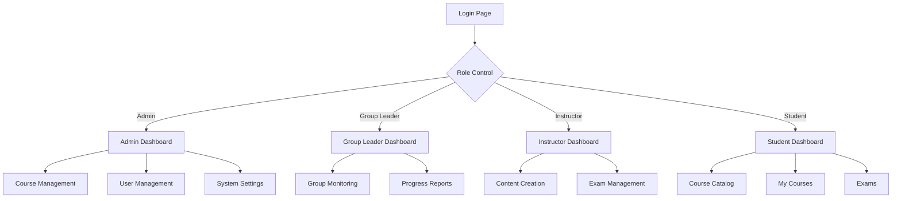

## 1. Product Overview
LMS (Learning Management System) - Admin yönetimli, grup liderleri tarafından izlenebilen eğitim platformu. Kurslar, dersler, dokümanlar, videolar ve sınavların yönetildiği kapsamlı bir öğrenme ortamı sunar.

Eğitim içeriklerinin merkezi yönetimi, kullanıcı bazlı ilerleme takibi ve detaylı raporlama imkanı sağlar.

## 2. Core Features

### 2.1 User Roles
| Role | Registration Method | Core Permissions |
|------|---------------------|------------------|
| Admin | Admin panelinden manuel oluşturma | Tüm sistem yönetimi, kullanıcı ve içerik CRUD işlemleri |
| Group Leader | Admin tarafından atama | Grup üyelerini izleme, ilerleme raporları, içerik görüntüleme |
| Instructor | Admin tarafından atama | Ders oluşturma, içerik yükleme, sınav hazırlama |
| Student | Email/kullanıcı adı ile kayıt | Kurslara katılma, içerik görüntüleme, sınav olma |

### 2.2 Feature Module
LMS sistemimiz aşağıdaki temel sayfalardan oluşmaktadır:

1. **Dashboard**: Genel istatistikler, kurs ilerlemeleri, bildirimler
2. **Kurs Yönetimi**: Kurs oluşturma, düzenleme, yayınlama ve silme
3. **Ders İçerikleri**: Video yükleme, doküman ekleme, içerik düzenleme
4. **Sınav Sistemi**: Sınav oluşturma, soru bankası, otomatik değerlendirme
5. **Kullanıcı Yönetimi**: Kullanıcı ekleme, rol atama, grup yönetimi
6. **İlerleme Takibi**: Öğrenci ilerlemeleri, tamamlama raporları
7. **Raporlama**: Detaylı analizler, başarı grafikleri, export özellikleri

### 2.3 Page Details
| Page Name | Module Name | Feature description |
|-----------|-------------|---------------------|
| Dashboard | İstatistik Paneli | Toplam kurs, öğrenci, tamamlanma oranlarını göster. Gerçek zamanlı veri güncelleme sağla |
| Dashboard | Bildirim Sistemi | Yeni kurs bildirimleri, sınav hatırlatmaları, sistem duyuruları göster |
| Kurs Yönetimi | Kurs Listesi | Tüm kursları filtreleme, arama ve sıralama özellikleri sun |
| Kurs Yönetimi | Kurs Oluşturma | Başlık, açıklama, süre, zorunluluk durumu belirleme ve yayınlama |
| Kurs Yönetimi | Kurs Düzenleme | Mevcut kurs bilgilerini güncelleme, içerik ekleme/çıkarma |
| Ders İçerikleri | Video Yönetimi | Video yükleme, önizleme, süre sınırlaması ve format kontrolü |
| Ders İçerikleri | Doküman Yönetimi | PDF, Word, Excel dosyaları yükleme ve görüntüleme sağla |
| Ders İçerikleri | İçerik Sıralaması | Ders içeriklerini sürükle-bırak ile yeniden sırala |
| Sınav Sistemi | Sınav Oluşturma | Çoktan seçmeli, doğru/yanlış, boşluk doldurma soruları ekle |
| Sınav Sistemi | Soru Bankası | Soruları kategorilere ayırma, tekrar kullanım imkanı sun |
| Sınav Sistemi | Otomatik Değerlendirme | Sınav sonuçlarını anında hesapla ve raporla |
| Kullanıcı Yönetimi | Kullanıcı Listesi | Tüm kullanıcıları rol bazlı filtreleme ve arama |
| Kullanıcı Yönetimi | Rol Atama | Kullanıcılara admin, eğitmen, grup lideri rolleri ata |
| Kullanıcı Yönetimi | Grup Yönetimi | Öğrencileri gruplara ayırma, grup liderleri atama |
| İlerleme Takibi | Kurs İlerlemesi | Her öğrencinin kurs tamamlama yüzdesini takip et |
| İlerleme Takibi | İçerik Takibi | Video izleme süresi, doküman indirme durumu kaydet |
| Raporlama | Başarı Raporları | Grup ve bireysel başarı oranlarını grafiksel göster |
| Raporlama | Export Özellikleri | Raporları PDF/Excel formatında dışa aktarma |

## 3. Core Process

### Admin Flow
Admin kullanıcı sisteme giriş yaptıktan sonra tüm yönetim fonksiyonlarına erişebilir. Kurs oluşturur, eğitmen atar, içerik yükler ve sistem ayarlarını yapılandırır. Grup liderlerini belirleyerek delegasyon sağlar.

### Group Leader Flow
Grup lideri kendi grubundaki öğrencilerin ilerlemesini izler, raporları inceler ve gerekli durumlarda admin ile iletişime geçer. Sadece kendi grubuna ait verilere erişim hakkına sahiptir.

### Instructor Flow
Eğitmen kendisine atanan kurslarda ders oluşturur, içerik yükler ve sınavlar hazırlar. Öğrenci performanslarını takip edebilir.

### Student Flow
Öğrenci kurslara kaydolur, ders içeriklerini izler, dokümanları indirir ve sınavlara katılır. Kendi ilerlemesini takip edebilir.

## 4. User Interface Design

### 4.1 Design Style
- **Primary Color**: #2563eb (Modern mavi)
- **Secondary Color**: #64748b (Gri tonları)
- **Accent Color**: #10b981 (Yeşil - başarı için)
- **Button Style**: Yuvarlak köşeler, hover efektleri, modern gradient'ler
- **Font**: Inter (modern ve okunabilir)
- **Layout**: Kart bazlı tasarım, sol yan navigasyon, responsive grid sistemi
- **Icon Style**: Material Design ikon seti, tutarlı boyutlandırma

### 4.2 Page Design Overview
| Page Name | Module Name | UI Elements |
|-----------|-------------|-------------|
| Dashboard | İstatistik Paneli | Card layout'ta KPI'lar, renk kodlu ilerleme çubukları, animasyonlu sayaçlar |
| Dashboard | Bildirim Sistemi | Üst köşede bildirim ikonu, dropdown panel, badge sayaçları |
| Kurs Yönetimi | Kurs Listesi | Tablo görünümü, arama kutusu, filtre butonları, action menüler |
| Kurs Yönetimi | Kurs Formu | Adım adım form, validasyon ikonları, progress bar, kaydetme animasyonu |
| Ders İçerikleri | Video Player | Modern video player, süre göstergesi, playback hız kontrolü |
| Ders İçerikleri | Doküman Listesi | İkon bazlı dosya tipleri, indirme butonları, boyut bilgileri |
| Sınav Sistemi | Sınav Ekranı | Soru numaralandırma, süre sayacı, işaretleme sistemi, geri bildirim |
| Kullanıcı Yönetimi | Kullanıcı Tablosu | Avatar gösterimi, rol renk kodları, durum ikonları, toplu işlemler |
| İlerleme Takibi | Progress Chart | Dairesel progress bar, yüzde gösterimi, renkli tamamlama durumları |
| Raporlama | Grafikler | Interactive chart'lar, export butonları, tarih aralığı seçici |

### 4.3 Responsiveness
Desktop-first yaklaşımı benimsenmiştir. Tablet ve mobil cihazlara tam uyumlu responsive tasarım. Touch gesture desteği, mobil menü optimizasyonu ve içerik adaptasyonu mevcuttur. Minimum 320px genişliğe kadar destek sağlanmaktadır.