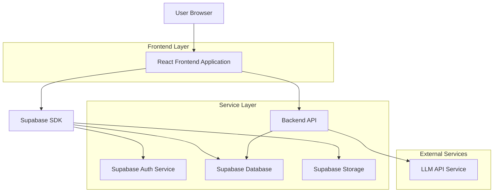
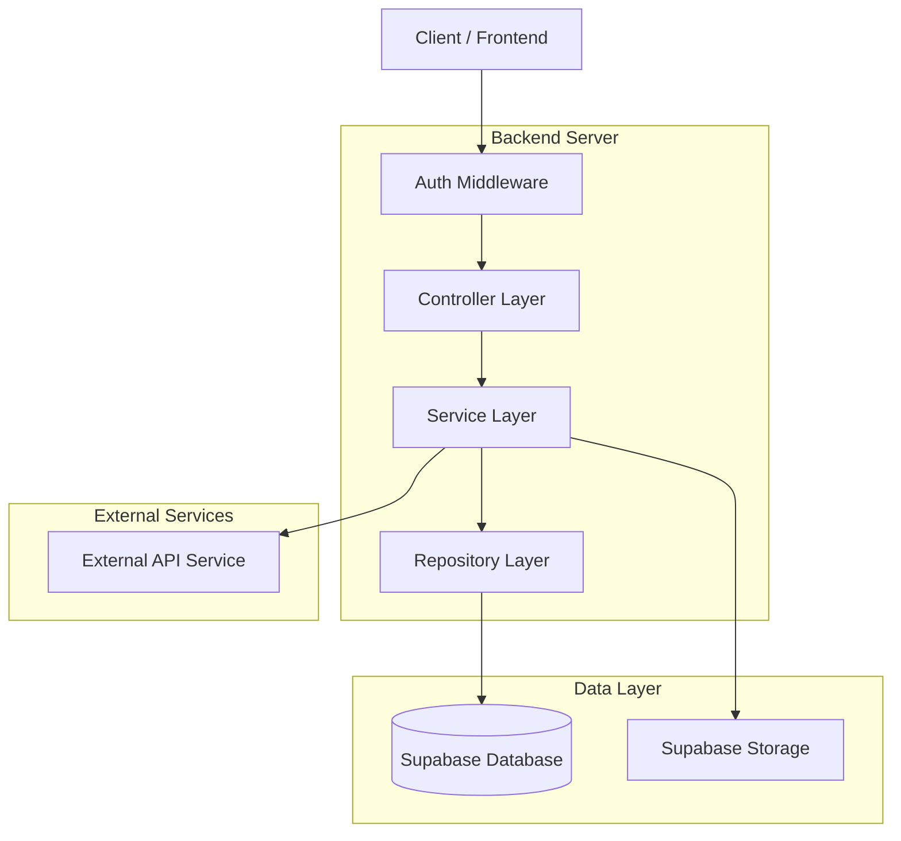
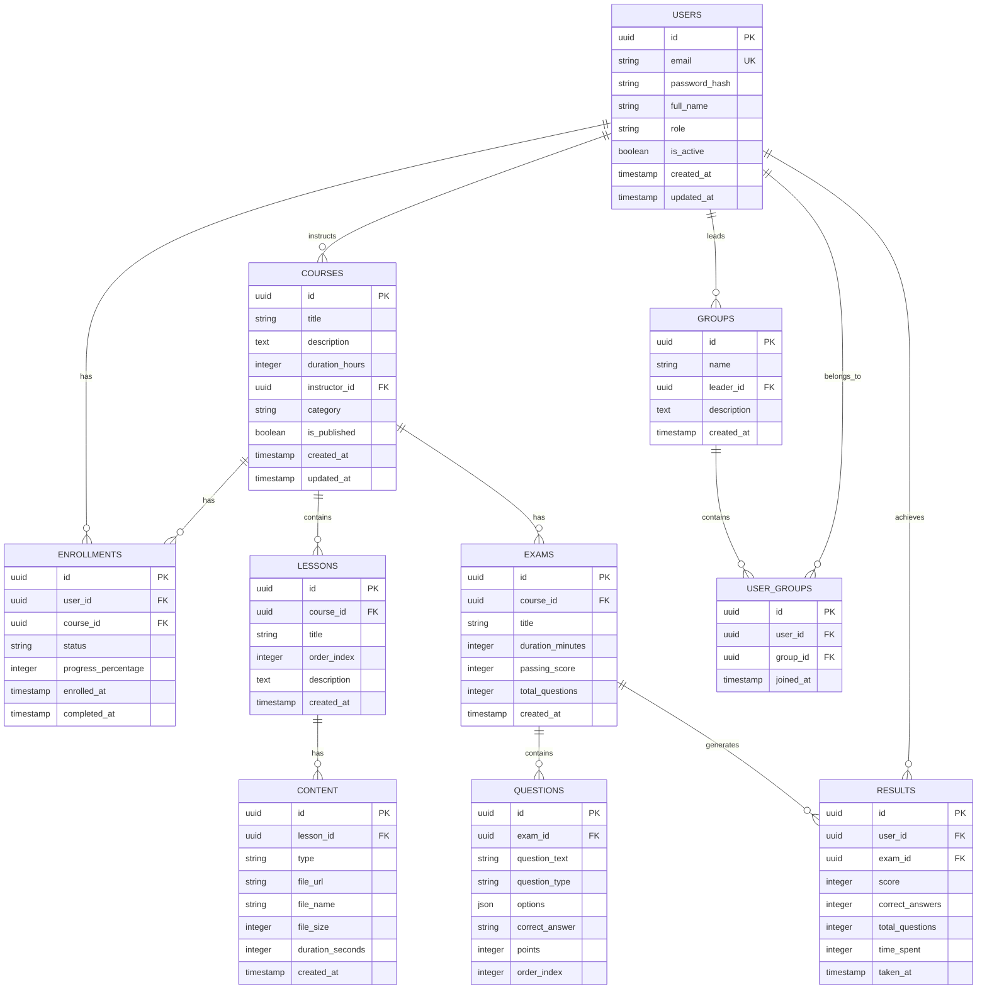

## 1. Architecture design



## 2. Technology Description

- **Frontend**: React@18 + tailwindcss@3 + vite
- **Initialization Tool**: vite-init
- **Backend**: Express@4 + Supabase
- **Database**: Supabase (PostgreSQL)
- **Authentication**: Supabase Auth
- **File Storage**: Supabase Storage
- **State Management**: React Context API + useReducer
- **UI Components**: Material-UI@5 + React Icons
- **HTTP Client**: Axios
- **Form Validation**: React Hook Form + Yup
- **Charts**: Chart.js + React Chartjs-2

## 3. Route definitions

| Route | Purpose |
|-------|---------|
| / | Login page, kullanıcı girişi |
| /dashboard | Ana dashboard, rol bazlı yönlendirme |
| /admin/courses | Admin kurs yönetimi |
| /admin/users | Admin kullanıcı yönetimi |
| /admin/settings | Sistem ayarları |
| /instructor/courses | Eğitmen kurs yönetimi |
| /instructor/content | İçerik yönetimi |
| /instructor/exams | Sınav yönetimi |
| /group-leader/monitoring | Grup izleme paneli |
| /group-leader/reports | Raporlama ekranı |
| /student/courses | Öğrenci kurs kataloğu |
| /student/my-courses | Katıldığım kurslar |
| /student/exams | Sınavlar |
| /student/progress | İlerleme takibi |
| /profile | Kullanıcı profili |

## 4. API definitions

### 4.1 Authentication APIs

```
POST /api/auth/login
```

Request:
| Param Name | Param Type | isRequired | Description |
|------------|------------|------------|-------------|
| email | string | true | Kullanıcı email adresi |
| password | string | true | Kullanıcı şifresi |

Response:
| Param Name | Param Type | Description |
|------------|------------|-------------|
| token | string | JWT token |
| user | object | Kullanıcı bilgileri ve rolü |
| expiresIn | number | Token geçerlilik süresi |

Example:
```json
{
  "email": "admin@lms.com",
  "password": "securePassword123"
}
```

### 4.2 Course Management APIs

```
GET /api/courses
```

Request:
| Param Name | Param Type | isRequired | Description |
|------------|------------|------------|-------------|
| page | number | false | Sayfa numarası |
| limit | number | false | Sayfa başına kayıt |
| search | string | false | Arama terimi |
| category | string | false | Kategori filtresi |

Response:
| Param Name | Param Type | Description |
|------------|------------|-------------|
| courses | array | Kurs listesi |
| total | number | Toplam kurs sayısı |
| page | number | Mevcut sayfa |

```
POST /api/courses
```

Request:
| Param Name | Param Type | isRequired | Description |
|------------|------------|------------|-------------|
| title | string | true | Kurs başlığı |
| description | string | true | Kurs açıklaması |
| duration | number | true | Kurs süresi (saat) |
| instructorId | string | true | Eğitmen ID |
| category | string | true | Kategori |
| isPublished | boolean | true | Yayın durumu |

### 4.3 Content Management APIs

```
POST /api/content/upload
```

Request (Form Data):
| Param Name | Param Type | isRequired | Description |
|------------|------------|------------|-------------|
| file | file | true | Yüklenecek dosya |
| type | string | true | content/video/document |
| courseId | string | true | Hedef kurs ID |
| lessonId | string | true | Hedef ders ID |

```
GET /api/content/{courseId}
```

Response:
| Param Name | Param Type | Description |
|------------|------------|-------------|
| content | array | İçerik listesi |
| videos | array | Video içerikleri |
| documents | array | Doküman içerikleri |

### 4.4 Exam APIs

```
POST /api/exams
```

Request:
| Param Name | Param Type | isRequired | Description |
|------------|------------|------------|-------------|
| title | string | true | Sınav başlığı |
| courseId | string | true | Kurs ID |
| duration | number | true | Süre (dakika) |
| questions | array | true | Soru listesi |
| passingScore | number | true | Geçme notu |

```
POST /api/exams/{examId}/submit
```

Request:
| Param Name | Param Type | isRequired | Description |
|------------|------------|------------|-------------|
| answers | array | true | Cevaplar |
| studentId | string | true | Öğrenci ID |
| timeSpent | number | true | Harcanan süre |

## 5. Server architecture diagram



## 6. Data model

### 6.1 Data model definition



### 6.2 Data Definition Language

**Users Table**
```sql
CREATE TABLE users (
    id UUID PRIMARY KEY DEFAULT gen_random_uuid(),
    email VARCHAR(255) UNIQUE NOT NULL,
    password_hash VARCHAR(255) NOT NULL,
    full_name VARCHAR(255) NOT NULL,
    role VARCHAR(50) NOT NULL CHECK (role IN ('admin', 'instructor', 'group_leader', 'student')),
    is_active BOOLEAN DEFAULT true,
    created_at TIMESTAMP WITH TIME ZONE DEFAULT NOW(),
    updated_at TIMESTAMP WITH TIME ZONE DEFAULT NOW()
);

CREATE INDEX idx_users_email ON users(email);
CREATE INDEX idx_users_role ON users(role);
```

**Courses Table**
```sql
CREATE TABLE courses (
    id UUID PRIMARY KEY DEFAULT gen_random_uuid(),
    title VARCHAR(255) NOT NULL,
    description TEXT,
    duration_hours INTEGER,
    instructor_id UUID REFERENCES users(id) ON DELETE SET NULL,
    category VARCHAR(100),
    is_published BOOLEAN DEFAULT false,
    created_at TIMESTAMP WITH TIME ZONE DEFAULT NOW(),
    updated_at TIMESTAMP WITH TIME ZONE DEFAULT NOW()
);

CREATE INDEX idx_courses_instructor ON courses(instructor_id);
CREATE INDEX idx_courses_category ON courses(category);
CREATE INDEX idx_courses_published ON courses(is_published);
```

**Lessons Table**
```sql
CREATE TABLE lessons (
    id UUID PRIMARY KEY DEFAULT gen_random_uuid(),
    course_id UUID REFERENCES courses(id) ON DELETE CASCADE,
    title VARCHAR(255) NOT NULL,
    order_index INTEGER NOT NULL,
    description TEXT,
    created_at TIMESTAMP WITH TIME ZONE DEFAULT NOW()
);

CREATE INDEX idx_lessons_course ON lessons(course_id);
CREATE INDEX idx_lessons_order ON lessons(order_index);
```

**Content Table**
```sql
CREATE TABLE content (
    id UUID PRIMARY KEY DEFAULT gen_random_uuid(),
    lesson_id UUID REFERENCES lessons(id) ON DELETE CASCADE,
    type VARCHAR(50) NOT NULL CHECK (type IN ('video', 'document', 'audio')),
    file_url TEXT NOT NULL,
    file_name VARCHAR(255),
    file_size INTEGER,
    duration_seconds INTEGER,
    created_at TIMESTAMP WITH TIME ZONE DEFAULT NOW()
);

CREATE INDEX idx_content_lesson ON content(lesson_id);
CREATE INDEX idx_content_type ON content(type);
```

**Exams Table**
```sql
CREATE TABLE exams (
    id UUID PRIMARY KEY DEFAULT gen_random_uuid(),
    course_id UUID REFERENCES courses(id) ON DELETE CASCADE,
    title VARCHAR(255) NOT NULL,
    duration_minutes INTEGER NOT NULL,
    passing_score INTEGER NOT NULL,
    total_questions INTEGER NOT NULL,
    created_at TIMESTAMP WITH TIME ZONE DEFAULT NOW()
);

CREATE INDEX idx_exams_course ON exams(course_id);
```

**Questions Table**
```sql
CREATE TABLE questions (
    id UUID PRIMARY KEY DEFAULT gen_random_uuid(),
    exam_id UUID REFERENCES exams(id) ON DELETE CASCADE,
    question_text TEXT NOT NULL,
    question_type VARCHAR(50) NOT NULL CHECK (question_type IN ('multiple_choice', 'true_false', 'fill_blank')),
    options JSONB,
    correct_answer VARCHAR(255) NOT NULL,
    points INTEGER DEFAULT 1,
    order_index INTEGER NOT NULL
);

CREATE INDEX idx_questions_exam ON questions(exam_id);
```

**Enrollments Table**
```sql
CREATE TABLE enrollments (
    id UUID PRIMARY KEY DEFAULT gen_random_uuid(),
    user_id UUID REFERENCES users(id) ON DELETE CASCADE,
    course_id UUID REFERENCES courses(id) ON DELETE CASCADE,
    status VARCHAR(50) DEFAULT 'active' CHECK (status IN ('active', 'completed', 'suspended')),
    progress_percentage INTEGER DEFAULT 0,
    enrolled_at TIMESTAMP WITH TIME ZONE DEFAULT NOW(),
    completed_at TIMESTAMP WITH TIME ZONE,
    UNIQUE(user_id, course_id)
);

CREATE INDEX idx_enrollments_user ON enrollments(user_id);
CREATE INDEX idx_enrollments_course ON enrollments(course_id);
CREATE INDEX idx_enrollments_status ON enrollments(status);
```

**Results Table**
```sql
CREATE TABLE results (
    id UUID PRIMARY KEY DEFAULT gen_random_uuid(),
    user_id UUID REFERENCES users(id) ON DELETE CASCADE,
    exam_id UUID REFERENCES exams(id) ON DELETE CASCADE,
    score INTEGER NOT NULL,
    correct_answers INTEGER NOT NULL,
    total_questions INTEGER NOT NULL,
    time_spent INTEGER,
    taken_at TIMESTAMP WITH TIME ZONE DEFAULT NOW()
);

CREATE INDEX idx_results_user ON results(user_id);
CREATE INDEX idx_results_exam ON results(exam_id);
CREATE INDEX idx_results_score ON results(score);
```

**Groups Table**
```sql
CREATE TABLE groups (
    id UUID PRIMARY KEY DEFAULT gen_random_uuid(),
    name VARCHAR(255) NOT NULL,
    leader_id UUID REFERENCES users(id) ON DELETE SET NULL,
    description TEXT,
    created_at TIMESTAMP WITH TIME ZONE DEFAULT NOW()
);

CREATE INDEX idx_groups_leader ON groups(leader_id);
```

**User Groups Table**
```sql
CREATE TABLE user_groups (
    id UUID PRIMARY KEY DEFAULT gen_random_uuid(),
    user_id UUID REFERENCES users(id) ON DELETE CASCADE,
    group_id UUID REFERENCES groups(id) ON DELETE CASCADE,
    joined_at TIMESTAMP WITH TIME ZONE DEFAULT NOW(),
    UNIQUE(user_id, group_id)
);

CREATE INDEX idx_user_groups_user ON user_groups(user_id);
CREATE INDEX idx_user_groups_group ON user_groups(group_id);
```

**Supabase Row Level Security Policies**
```sql
-- Grant basic permissions
GRANT SELECT ON ALL TABLES IN SCHEMA public TO anon;
GRANT ALL PRIVILEGES ON ALL TABLES IN SCHEMA public TO authenticated;

-- Course policies
CREATE POLICY "Courses are viewable by everyone" ON courses FOR SELECT USING (is_published = true);
CREATE POLICY "Instructors can manage their courses" ON courses FOR ALL USING (auth.uid() = instructor_id);
CREATE POLICY "Admins can manage all courses" ON courses FOR ALL USING (EXISTS (
  SELECT 1 FROM users WHERE id = auth.uid() AND role = 'admin'
));

-- User policies
CREATE POLICY "Users can view their own profile" ON users FOR SELECT USING (auth.uid() = id);
CREATE POLICY "Admins can manage all users" ON users FOR ALL USING (EXISTS (
  SELECT 1 FROM users WHERE id = auth.uid() AND role = 'admin'
));

-- Enrollment policies
CREATE POLICY "Users can view their own enrollments" ON enrollments FOR SELECT USING (auth.uid() = user_id);
CREATE POLICY "Group leaders can view group enrollments" ON enrollments FOR SELECT USING (EXISTS (
  SELECT 1 FROM user_groups ug 
  JOIN groups g ON ug.group_id = g.id 
  WHERE ug.user_id = enrollments.user_id AND g.leader_id = auth.uid()
));
```