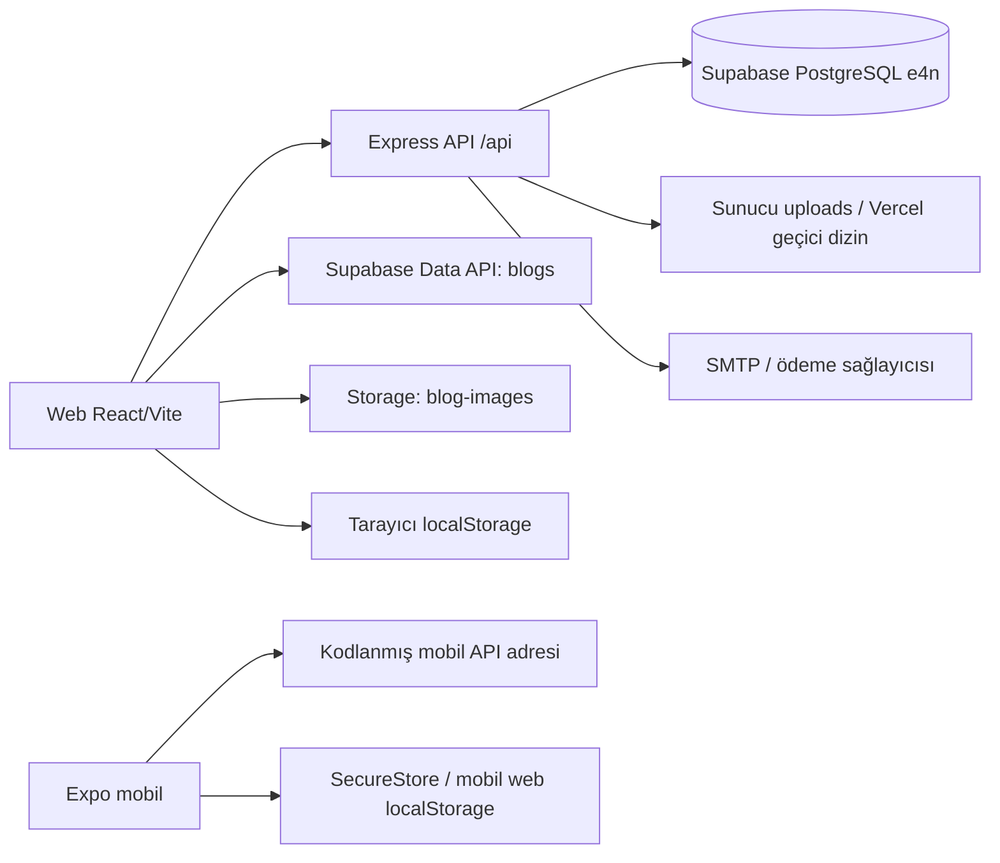

# Mevcut E4N sistem haritası — denetim baz çizgisi

**İnceleme tarihi:** 1 Ekim 2026. **Web/API üretim commit'i:** `7ead1690ab1b7344fe2ea98d6217700e3f39e0ab`; Vercel `e4n` READY dağıtımı ve `event4network.com` alias'ı doğrulandı. Mobil ayrı depoda `db2028480fa28ad1a421d14189345f04368130c8` ve commit edilmemiş değişikliklerle incelendi; yayın sürümü bilinmiyor. Bu harita kaynak, canlı Supabase katalog verisi ve sınırlı üretim GET gözlemidir. Kullanıcı hesabıyla iş akışları çalıştırılmadı.

## Sistem sınırları

Ana web ve Express API aynı Vercel `e4n` projesi üzerinden yapılandırılmıştır. Mobilin üretim adresi `e4n-backend.vercel.app` bağlı Vercel projesinin alan adı değildir; iki örnek GET 404 döndü. `src/api/api.ts` geliştirme portu 4005, yerel sunucu 4000 kullanır. Docker PostgreSQL 5433 hedefi denetim anında çalışmıyordu. Ayrıntı [[E4N/02-Mevcut-Sistem/Calisma-Yollari-ve-Arka-Plan|çalışma yollarında]].

## Kullanıcı yüzeyi ve kod kaynakları

| Paket | Kaynakta sayılan | Harita |
|---|---:|---|
| Web route | 77 yol tanımı, `src/pages` içinde 75 TSX dosyası | [[E4N/02-Mevcut-Sistem/Web-Route-Envanteri|tam route listesi]], [[E4N/02-Mevcut-Sistem/Sayfa-ve-Modul-Haritasi|modüller]] |
| Web bileşenleri | `src/components` 16, `src/shared` 23 dosya | [[E4N/03-Komponentler/Katalog|katalog]], [[E4N/03-Komponentler/Kullanim-Haritasi|import kullanımı]] |
| API | `server/src/index.js` 135, bağlı `server/src/routes/admin.js` 16 uç; 17 aynı method/path tekrarı | [[E4N/02-Mevcut-Sistem/API-Uc-Noktalari|uç listesi]] |
| Mobil | Expo Router altında 33 TSX dosyası | [[E4N/02-Mevcut-Sistem/Mobil-Envanteri|ekran ve istek eşleşmesi]] |
| Veritabanı | 34 `public` tablo, 307 alan, 43 FK, 113 kısıt, 58 indeks | [[E4N/02-Mevcut-Sistem/Canli-Sema-Katalogu|kolon kataloğu]], [[E4N/02-Mevcut-Sistem/Canli-Veri-Iliskileri|ilişkiler]], [[E4N/02-Mevcut-Sistem/Veritabani-Sema-Denetimi|model denetimi]] |

`api/index.js` ana Express dosyasını dışa aktarır. `server/src/routes/admin.js` `/api/admin` altında önce bağlanır; diğer route modülleri giriş dosyasına bağlanmadığından aktif uç sayılmaz. Web istemcisinde bağlı API'de yolu bulunmayan 19 çağrı konumu ve yöntemi eşleşmeyen iki kalıp; mobilde ayrıca ayrı uyumsuz yollar bulundu: [[E4N/02-Mevcut-Sistem/Istemci-API-Eslesmesi|istemci/API eşleşmesi]].

## Veri sahipliği ve işlem zincirleri

| İş | Giriş / servis | Kalıcı kayıt ve dış etki | Mevcut davranışın sınırı |
|---|---|---|---|
| Davetli üye kaydı | Web/Mobil → `/auth/register` | `users`, gerekirse `professions`; parola hash ve onay alanları | Normal kayıt davet token'ı ister; `COMMUNITY_MEMBER` yolu ayrı ve ACTIVE başlayabilir. Şirket alanı boş string olabilir (`server/src/index.js:541–600`). |
| Giriş ve abonelik görünümü | `/auth/login`, `/users/me`, `/memberships` | Okuma: `users`, `group_members`; JWT/tarayıcı veya SecureStore | Girişte süresi biten abonelik yanıtta PASSIVE hesaplanır, DB satırı güncellenmez (`:891–939`). `memberships` ayrı tablo değil, `users` alanlarından türetilir (`:3853–3967`). |
| Grup ve lonca | `/groups/:id/join`, `/power-teams/:id/join`, başkan paneli | `group_members`, `power_team_members` | Her ikisi ACTIVE hesap ister ve REQUESTED durumuyla başlar; lonca `power_teams` olarak etiketlenir (`AdminGroups`, `PowerTeams`). Başkan paneli REJECTED gönderebilir; canlı check kısıtı REJECTED kabul etmez. Kabulde 35 veya görüşme kaydı kontrolü yok (`:3340–3457`). |
| Puan | Katılım, referans, ziyaretçi, birebir, eğitim → `calculateMemberScore` | `users.performance_score/color`; `user_score_history` denemesi | Son 6 aylık hareketlerden 0–100 değer; tarihçenin canlı tablosu yok. Aylık kapanış veya puandan otomatik grup çıkarma bulunmadı (`:299–407`). |
| Shuffle | `AdminShuffle` → istemci `distributeMembers` → `/shuffle/save` | `users.role`, `group_members`; bildirim çağrısı | Ekran ilk dağılımı ve geçmişi örnek/indeks tabanlı kurar, gün kuralını demo olarak açar. Algoritma eşit meslek kontrolü yapar; 35 kapasite yok. API ACTIVE üyelikleri INACTIVE yapar, canlı check bunu reddeder; sonraki `/shuffle/notify` bağlı route değildir (`src/pages/AdminShuffle.tsx:32–177`, `src/utils/shuffleAlgorithm.ts`, `server/src/index.js:3486–3536`). |
| Etkinlik ve bilet | `/events`, `/events/:id/register`, ödeme callback'i | `events`, `attendance`, `event_tickets`, `payment_transactions`; e-posta | Kayıtta `attendance.status=PRESENT` gelecekteki katılım için de kullanılır. Ücretli etkinlik ödeme akışına gider; üyelikten gelen indirim hesabı kod taramasında bulunmadı (`:1291–1415`, `:2178–2599`). Üretim açık `/api/events` 500 veriyor. |
| Ziyaretçi | `/visitors/apply`, `/visitors`, admin dönüşüm | `public_visitors`, `visitors`, gerekirse `users`; e-posta | `public_visitors` form ve etkinlik başvurularını taşır. `visitors/:id/convert` canlı check'in kabul etmediği CONVERTED yazar (`:1078–1114`). |
| Ödeme/üyelik yenileme | `PaymentModal` → `/payment/pay` → sağlayıcı callback'i | `payment_transactions`, `users.subscription_*`, olay tipine göre diğer tablolar | Plan süresi ve üyelik ACTIVE durumu callback'te güncellenir. Üyelik hakları için tek merkezi politika modülü görülmedi; ödeme endpoint'i ayrı akışlara dallanır. |
| Blog ve medya | `AdminBlogs`, `AdminBlogEditor` | Supabase `blogs`, `blog-images` public Storage | API yerine doğrudan Data API; canlı blog satırı 0. |
| Fatura | Yönetim `/admin/accounting/*/upload-invoice` | Yerel `uploads` / Vercel geçici dosya + `users` veya `public_visitors` URL | Dosya kalıcılığı veritabanı kaydından ayrı; Vercel çalışma ortamındaki kalıcılık kanıtlanmadı. |
| E-posta/arka plan | API SMTP ayarı, cron; ayrı e-posta servisi | `email_configurations`, `system_settings`, `notifications`, `champions`, yerel e-posta JSON/log | Kodda cron tanımları var; Vercel'de düzenli çalıştığı doğrulanmadı. İki e-posta yolu bulunuyor. |

## Mevcut veri fotoğrafı

Canlı `e4n` veritabanında 23 kullanıcı (21 ACTIVE, 2 PENDING), 1 grup/11 ACTIVE üye, 3 lonca (`power_teams`)/2 üyelik, 6 etkinlik/2 katılım/0 bilet, 5 ödeme işlemi, 402 genel ziyaretçi başvurusu var. Bunlar 1 Ekim 2026 toplu sayımlarıdır; kişisel satır içeriği kullanılmadı. Tüm tablo sayıları [[E4N/02-Mevcut-Sistem/Canli-Supabase-Tablolari|ayrı notta]].

## Doğrulama düzeyi ve açık dış sınırlar

- **Doğrulandı:** Vercel üretim dağıtımı/commit/alan adı, canlı Supabase projesi/şema/ilişkiler/sayımlar, üretim sağlık isteği 200, açık etkinlik listesi 500 ve Vercel logundaki `42702 status ambiguous` hatası.
- **Kaynak+şema ile güçlü kanıt:** `INACTIVE`, `REJECTED`, `CONVERTED` durum kısıtı çelişkileri; puan geçmişi tablosu yokluğu; 35 kapasite ve çıkarılma geçmişi için veri modeli bulunmaması.
- **Çalıştırılmadı:** Kayıt, ödeme, grup kabul/çıkarma, shuffle, mobil kullanıcı akışları ve e-posta gönderimi. Üretim verisini değiştirebilecek işlemler test edilmedi. GET `/api/events` kodda UPDATE de içerdiği için ilk gözlemden sonra tekrar çağrılmadı; ilk çağrının etkinlik durumunu değiştirmiş olup olmadığı bilinmiyor.
- **Harita sınırı olarak kayıtlı:** VPS paketinin gerçek trafik alıp almadığı, mobil mağaza sürümü, eski DB migration geçmişi ve Vercel cron çalışması. Bunlara erişim kanıtı olmadığından mevcut davranış gibi sunulmaz.

Bu belge mevcut sistemin baz çizgisidir. Hedef karşılaştırması [[E4N/06-Gap-Analizi/Gap-Matrisi|fark matrisinde]] yapılır; açık D kararları [[E4N/01-Kararlar/Acik-Kararlar|karar notunda]] kalır.
