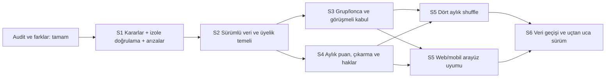

# E4N geliştirme ve değişim yol haritası

## 5 Ekim — mobil ve LMS en son

Kullanıcı kararı: şimdi kurs/eğitim/sınav kullanılmayacak; mobil ile birlikte görevlerden ayrılıp en son yapılacak. Aktif sıra **eğitim dışı web + gerekli API/veri → web stabilizasyon/operasyon/Sprint 6 güvenlik ve sürüm kabulü → son aşamadaki mobil ve LMS kuyrukları**. Eski sıradaki kursa bağlı sınav önerileri geçersizdir. Sınav için yalnız kaynak okundu; uygulama başlamadı.

Linear doğrulandı: Sprint 7 — Ertelenen mobil uygulama: E4N-104,134,114,115,116,117,118,119 (8 açık kayıt) Backlog/Low; aktif cycle kaldırıldı. Sprint 8 — Ertelenen kurs, eğitim ve sınav: yeni E4N-139 LMS-SON Backlog/Low. Önceki Done mobil/web teslimleri korunur. Ana PAR ve alt görev sayımı ürün yüzdesi değildir. Aktif web/ortak API işi P30/P31/P39/P40 kapsamında sürer; web kabulünde mobil veya LMS eksikleri tamamlandı gibi gösterilmez, ertelenmiş kapsam olarak ayrılır.

P37/E4N-109 web regresyonu olarak ayrıldı ve E4N-104 mobil blockedBy bağı kaldırıldı; diğer web/veri bağımlılıkları korundu. SEC-03/E4N-120 web/API/Supabase sürüm denetimi olarak güncellendi; mevcut yayındaki LMS erişim riskleri göz ardı edilmez, yeni LMS özellik geliştirme/kabulü ertelidir. Gelecek mobil/LMS sürümünde ayrıca regresyon ve güvenlik kabulü yapılır. D01–D10 kapıları ve canlıya yazmama sınırı korunur.

Zamanlanan E4N Linear görevlerini sürdür talimatı güncellendi; ACTIVE/15 dakika, mevcut iş varsa sessiz atlama korunur. Teslim edilen E4N-133/135/136/137/138 tekrar seçilmez; web işi varken mobil ve LMS başlamaz.

Güncel Linear: **83 toplam = 27 Done / 14 In Progress / 42 Backlog**. Bunun 9 kaydı ertelenen son aşama; bunlar çıkarıldığında 74 kayıt = 27 Done / 14 In Progress / 33 Backlog. Sayı değişimi kapsam/durum düzenlemesidir, yeni kod ilerlemesi değildir. Son kod b56d119; şema12/40 canlı uygulanmadı. Genel belge merkezi E4N-138 Done eğitim/sınav teslimi değildir. Mevcut menüleri/kodu/veriyi silme veya saklama kararı verilmedi.

Sonraki seçim: eğitim dışı aktif web/API/rol/veri akışlarında karar gerektirmeyen bütün paket; P39/P40 mevcut kaynak+Linear ilişkileri tekrar okunarak seçilir. Üye oluşturma ve shuffle için D bağımlılıkları atlanmaz.

**Hazırlanma:** 1 Ekim 2026. **Durum:** Sprint 1 uygulaması başladı; ayrıntılı ilerleme [[E4N/00-Proje/Devam-Notu|devam notunda]]. Dayanaklar: [[E4N/00-Proje/E4N_Denetim_Dokumantasyon_ve_Gelistirme_Master_Plani|master plan]], [[E4N/01-Kararlar/Kararlar|R01–R15]], [[E4N/01-Kararlar/Acik-Kararlar|D01–D10]], [[E4N/02-Mevcut-Sistem/Tam-Sistem-Haritasi|mevcut harita]], [[E4N/06-Gap-Analizi/Gap-Matrisi|G01–G15/T01–T08]], [[E4N/06-Gap-Analizi/Koru-Degistir-Ekle-Kaldirmayi-Degerlendir|koru/değiştir/ekle/kaldır matrisi]] ve [[E4N/07-Hata-Denetimi/Mevcut-Hata-ve-Calisma-Durumu|H01–H19]]. Canlı veriye bu plan kapsamında yazılmaz; kaynak düzeltmeleri ayrı dalda yapılır. Takvim/süre tahmini yoktur; sprintler bağımlılık ve çıkış koşulu sırasıdır.

## Son durumun sade özeti

E4N'de web, API, mobil ve canlı Supabase bağlantısı var. Sağlık yolu yanıtlıyor; açık etkinlik listesi 500. Mobil kaynakta yazan API adresindeki örnek yollar 404. Bildirim, puan geçmişi, üyelik durumu ve ziyaretçi dönüşümü alanlarında kod–canlı şema uyuşmazlıkları var. Web/mobil istemcilerinin bazı çağrıları bağlı API'de karşılık bulmuyor. Mevcut ödeme/üyelik/grup/etkinlik modeli hedef R01–R12 kurallarını bütünüyle temsil etmiyor. Güvenlik E4N-58/59 kullanıcı kararıyla beklemede.

## Plan ilkeleri

1. **Ayrımlar:** Hesap, E4N üyeliği, açık lonca, kapalı grup başvurusu/ataması, grup yasağı ve etkinlik hakkı ayrı kavramlardır. Grup kaybı üyeliği veya dış etkinlik hakkını kendiliğinden silmez (R01–R03, R12).
2. **Veri önce:** Canlı 34 tabloya dokunmadan önce sürümlü migration, mevcut veri eşlemesi, sayım, geri dönüş ve izole deneme hazırlanır. Çıkarılma/puan geçmişi yoksa uydurulmaz.
3. **Aynı kural her girişte:** Kabul, admin taşıması ve shuffle aynı kapasite/çakışma kuralına; UI ve API aynı yasak/hak hesabına dayanır. Eşzamanlı işlem ve tekrar çağrı test edilir.
4. **Kanıtlı kapanış:** Linear işi ancak kabul ölçütü, ilgili test, Obsidian güncellemesi ve gerçek kod/PR bağlantısı tamamlanınca Done olur. Ekranın görünmesi tek başına yeterli değildir.
   Her değişiklikte ilgili rol/yetki, veri erişimi ve yazma etkisi de kendi testinde kontrol edilir. Hedef özellikler tamamlanınca [E4N-120](https://linear.app/e4n/issue/E4N-120/sec-03-gelistirmelerden-sonra-web-mobil-api-ve-supabase-guvenlik) bütünleşik web–mobil–API–Supabase güvenlik denetimi yapılır; E4N-58/59 ertelenmiş kapsam bu kapıda ele alınır ve P38 sürüm kararı denetim sonucuna bağlıdır.
5. **Açık karar korunur:** D01–D10 cevaplanmadan eşik, ücret, ay hesabı, başkan yetkisi veya hizmet eşlemesi canlı davranış olarak seçilmez. Bağımsız teknik hazırlık sürer.
6. **Pardus sınırı:** Pardus Business Chamber ayrı, ücretsiz ve seçici kalır; E4N üyelik/ödeme modeline katılmaz (R13).

## Bağımlılık akışı

## Sprintler ve çıkış koşulları

| Sprint | Amaç | İş paketleri | Çıkış koşulu |
|---|---|---|---|
| **0 — Denetim** | Mevcut sistemi ve hedef farklarını kanıtlamak | E4N-57/60/61/62/63/64; Obsidian envanteri | Tam harita, DB ve hata envanteri, R01–R15 fark matrisi hazır. **Tamamlandı.** |
| **1 — Karar ve stabilizasyon** | Kodlamaya güvenli başlangıç, gözlenen arızalar ve sözleşmeler | P01–P08, P40 | D01–D10 karar kayıtları sahipli; izole test DB/akışları; etkinlik 500 ve mobil adresi gibi gözlenen arızalar için doğrulanmış çözüm; bildirim/API sözleşmesi ve tekrarlanan route'ların doğrulaması; canlıya yazma yok. |
| **2 — Veri ve üyelik temeli** | Yeniden üretilebilir şema, üyelik/hak ve ödeme bağı | P09–P14 | Sürümlü migration denemesi ve sayım; üyelik/grup hakkı ayrımı; ödeme sahipliği/callback tekrar senaryosu; şirket kapsamı D10'a göre. |
| **3 — Lonca ve kapalı grup** | Uygunluk, görüşme, kapasite ve çakışmasız kabul | P15–P20 | Açık lonca ayrı; başkan görüşmesi ve yetkisi; son koltukta eşzamanlı kabul; hizmet çakışması ve durum geçişi testleri. |
| **4 — Puan, çıkarma ve dış haklar** | Aylık kayıt, otomatik çıkarma/yasak, etkinlik hakkı | P21–P26 | D01–D04 kuralına göre tekil puan/çıkarma; ikinci çıkarılmada sınır tarihi; üyelik ve dış etkinlik/indirim hakkı korunur. |
| **5 — Shuffle ve arayüz bütünlüğü** | Dört aylık yerleşim ve üye/başkan/admin/mobil deneyimi | P27–P33, P39, P41 | Simülasyon kural bozmaz; uygulama atomik/tekrar güvenli; geçmiş gerçek veridir; aktif web/mobil API ve hata/boş/erişim durumları uyumlu; eski/demo parçaların kullanımı kararlı. |
| **6 — Operasyon, geçiş ve sürüm** | Veri geçişi ve sürüm kanıtı | P34–P38 | Migration prova/sayım/geri dönüş, cron/dosya kalıcılığı doğrulaması, kritik T01–T14 senaryoları, sürüm raporu. Canlı uygulama ayrıca kararlaştırılır. |

Sprint bir haftalık süre veya teslim tarihi taahhüdü değildir. Eşzamanlı yürütülebilen işler sprint içinde bağımsız ilerleyebilir; bağlayıcı karar bekleyen davranışın Done sayılması engellenir. Linear takımında aktif cycle bulunmadığından bu sprintler E4N projesinde **milestone** olarak tutulur.

## Epic ve uygulanabilir iş listesi

Plan kodu, gerçek Linear ID'sinden farklıdır. Tüm yeni işlerin durumu başlangıçta Backlog'dur. Kayıtlarda problem/kanıt, hedef, kapsam dışı, R/D, bağımlılık, kabul ve doğrulama bulunur.

| Epic | Plan işleri / sprint | Somut kapsam | Başlıca kanıt/bağımlılık |
|---|---|---|---|
| **E1 — Karar ve stabilizasyon** | P01–P08, P40 / S1 | D kararlarını netleştir; izole test düzeni; etkinlik 500/GET yan etkisi, mobil adresi, bildirim sözleşmesi, API yolları ve tekrarlanan route'ları doğrula. | H01–H11; D01–D10; S2 ön koşulu |
| **E2 — Şema ve veri geçiş temeli** | P09–P11 / S2 | Sürümlü migration zinciri; canlı 34 tablo/307 alanla uyum ve veri profili; grup/puan/geçmiş için şema ve prova. | DB-01–DB-15; E1 izole ortam |
| **E3 — Üyelik, ödeme ve haklar** | P12–P14, P25–P26 / S2,S4 | Tek üyelik ve grup ayrımı; şirket uygunluğu; ödeme–hesap bağı ve callback idempotency; etkinlik kayıt/indirim hakkı. | G01–G03,G06,G12; D07,D10; E2 |
| **E4 — Lonca ve kapalı grup** | P15–P20 / S3 | Açık lonca; hizmet matrisi; başvuru/görüşme; kapasite ve eşzamanlı kabul; grup üyeliği yaşam döngüsü/geçmiş. | G03–G08; D05,D08,D09; E2/E3 |
| **E5 — Puan, çıkarma ve yasak** | P21–P24 / S4 | Aylık puan olayı ve kesinleşme, otomatik çıkarma, ikinci çıkarılmada sekiz ay başvuru yasağı, ekran/API tutarlılığı. | G09–G11; D01–D04; E2/E4 |
| **E6 — Dört aylık shuffle** | P27–P29 / S5 | Dönem ve uygun aday, önizleme/yerleşemeyen raporu, atomik uygulama ve atama geçmişi. | G05,G07; D06; E4/E5 |
| **E7 — Web/mobil kullanıcı akışları** | P30–P33, P39, P41 / S5 | Üye, başkan ve admin ekranları; aktif web/mobil API/yanıt sözleşmesi; içerikte tek üyelik/açık lonca/kapalı grup anlatımı ve eski/demo parça kararı. | G01–G15; E3–E6 |
| **E8 — Operasyon ve sürüm doğrulama** | P34–P38 / S6 | Cron, fatura dosyası, migration prova/geri dönüş, T01–T14 ve hata envanterindeki kritik regresyonlar, sürüm raporu. | H13–H18; bütün önceki epic'ler |

### İşlerin kabul ve doğrulama özeti

Web ve mobilde aynı işi tamamlama hedefi [E4N-114](https://linear.app/e4n/issue/E4N-114/par-web-ve-mobil-ozellik-esitligi-programi) altında ayrıca izlendi: PAR-01/E4N-115 yetenek-rol matrisi, PAR-02/E4N-116 API/veri sözleşmesi, PAR-03/E4N-117 genel/üye akışları, PAR-04/E4N-118 başkan/admin akışları ve PAR-05/E4N-119 iki platformlu uçtan uca kabul. [[E4N/06-Gap-Analizi/Web-Mobil-Ozellik-Esitligi|Kaynak bazlı eşitlik matrisi]] ilk kanıttır. E4N-117/118 uygulaması denetim ve ürün kararlarına; E4N-119 kabulü uygulama sonuçlarına bağlıdır.

| Kod | Teslim | Bağımlılık / karar | Kabul kanıtı |
|---|---|---|---|
| P01 | Puan/çıkarma karar paketi | D01–D04 | Faaliyet, eşik, değerlendirme, ilk/ikinci/üçüncü çıkarma ve sekiz ay tarih senaryoları kullanıcı kararı olarak kayıtlı; boşluklar bloke. |
| P02 | Çakışma/shuffle/grup karar paketi | D05,D06,D08,D09 | Hizmet örnekleri, başkan yetkisi, 35 sınırı ve shuffle sert/tercih koşulları yazılı. |
| P03 | Üyelik/şirket/ödeme karar paketi | D07,D10 | Hak, ödeme aksaması, şirket şartı ve kanıt aşaması net; Pardus ayrı. |
| P04 | İzole DB ve uçtan uca test düzeneği | Mevcut şema | Üretim dışı ortamda kritik akışlar tekrarlanabilir; veri örnekleri kişisel değildir. |
| P05 | Etkinlik listesi ve GET yan etkisi | H01,H03; GAP-T01 | Açık/admin etkinlik listesi doğru yanıt; GET hiçbir DB satırını değiştirmez; regresyon kontrolü. |
| P06 | Mobil API hedefi ve temel bağlantı | H02; GAP-T02 | Gerçek mobil yapılandırması doğru ortam API'sine gider; health/login/list smoke, yayın sürümü ayrı işaretli. |
| P07 | Bildirim şeması/API/istemci sözleşmesi | H07; GAP-T07, E2 | Tek alan sözleşmesi, yazma/okuma/okundu, web/mobil görünüm ve migration prova; canlı tablo varsayımıyla test. |
| P08 | Eksik/çakışan API ve durum yolları analizi | H04–H11 | 19+2 web, mobil yolları ve 17 tekrar için aktif kullanım/kalıcı hedef kararı; kritik REJECTED/INACTIVE/CONVERTED yolları izole testte sınıflı. |
| P09 | Sürümlü migration tabanı | P04,P08 | 34 tablo ve gerekli değişiklikler sıralı/tekrar güvenli; boş test DB kurulum ve mevcut DB yükseltme provasının sayımı kayıtlı. |
| P10 | Veri modeli ve mevcut veri eşlemesi | P01–P03,P09 | Üyelik/grup/dönem/puan/çıkarma/ödeme ilişki ve geçmiş modeli; 23 kullanıcı/11 grup üyesi/5 ödeme gibi baz sayımların geçiş karşılığı; tarihçe uydurulmaz. |
| P11 | Status ve şema drift uyumu | P09,P10 | Grup, lonca, ziyaretçi ve bildirim durum/kolon geçişleri tek sözlükte; `CHECK` ve API aynı; eski kayıtlar için dönüşüm/geri dönüş açık. |
| P12 | Tek üyelik ve grup erişim politikası | P03,P10 | Hesap/üyelik/grup/yasak ayrı; grup çıkışı üyelik durumunu değiştirmez; ortak sunucu hak hesabı. |
| P13 | Şirket uygunluğu | P03,P12 | D10 kapsamındaki kapıda ülke bağımsız veri/kanıt ve anlamlı ret nedeni; eski boş şirket kayıtlarının geçişi kararlaştırılmış. |
| P14 | Ödeme sahipliği ve callback | P03,P09,P12 | Üyelik işlemi kullanıcıyla ilişkilidir; callback tekrarında hak/ödeme iki kez oluşmaz; 5 mevcut işlemin dönüşüm kararı kayıtlı. |
| P15 | Açık lonca yaşam döngüsü | P12 | Lonca üyeliği kapalı grubun 35/başkan görüşmesi kuralını miras almaz; mevcut REQUESTED akışı hedefe göre kararlaştırılmış. |
| P16 | Hizmet sınıflandırması/çakışma denetimi | P02,P10 | Çoklu/yakın hizmetler örnek matrise göre son kayıt anında engellenir; admin/shuffle aynı kuralı kullanır. |
| P17 | Kapalı grup kapasitesi | P02,P10,P16 | D09'a göre son koltukta iki eşzamanlı kabul kapasiteyi aşamaz; admin/transfer yolu da korunur. |
| P18 | Başvuru ve başkan görüşmesi | P02,P13,P16,P17 | Başvuru, görüşme, sonuç ve yetkili onay izi; başka grubun başkanı erişemez; ret durumu kayıtlı. |
| P19 | Grup üyeliği/çıkış geçmişi | P10,P11,P12 | Atama/çıkış olayı silinmeden izlenir; tek aktif grup ve yeniden başvuru kuralı korunur. |
| P20 | Grup kabul/taşıma durum çelişkileri | P11,P16–P19 | REJECTED/INACTIVE yazma yolları izole DB'de geçer; işlem atomik ve izinli; DB-01 tetikleyici davranışı testli. |
| P21 | Aylık puan olay defteri | P01,P10 | Kaynak olay, ay, kural sürümü, düzeltme ve mükerrer kayıt anahtarı saklanır; eski toplamla uzlaşma açık. |
| P22 | Puan kesinleşmesi ve tablo | P01,P21 | Ay kapanışı tekrar güvenli; üye/admin dönem puanını ve gerekçesini görür; geçmişi olmayan kayıt uydurulmaz. |
| P23 | Otomatik çıkarma ve olay geçmişi | P01,P19,P22 | Eşik kararıyla yalnız kesinleşmiş ay değerlendirilir; aynı iş iki çıkarma yaratmaz; üyelik korunur. |
| P24 | İkinci çıkarılmada sekiz ay yasağı | P01,P23 | D03/D04 sayımı ve tarih sınırı API/UI'da aynı; yalnız kapalı grup başvurusu engellenir. |
| P25 | Etkinlik/bilet hak ve indirim politikası | P03,P12,P24 | Aktif üye gruptan çıkarılsa da dış etkinlik/indirim hakkı korunur; tutar ve callback aynı politikayı kullanır. |
| P26 | Etkinlik katılım, bilet ve ödeme bütünlüğü | P14,P25 | Kayıt ile gerçek katılım ayrılır; bilet tekrar/ödeme başarısızlığı durumları ve sayımlar testli. |
| P27 | Dört aylık dönem ve shuffle uygunluğu | P02,P19,P23,P24 | D06 ve R05'e göre gerçek dönem/tarih/aday listesi; eski 6 aylık grubun geçiş kararı kayıtlı. |
| P28 | Shuffle simülasyonu | P16,P17,P27 | 35 ve çakışma sert koşulları bozulmaz; yerleşmeyenler gerekçeli; mock geçmiş kullanılmaz. |
| P29 | Shuffle uygulama ve atama geçmişi | P20,P28 | Önizlenen sürümle atomik işlem; aynı dönem ikinci uygulama mükerrer kayıt üretmez; rollback ve bildirim sonucu açık. |
| P30 | Üye web paneli | P12,P18,P22,P24,P25 | Tek üyelik, grup, başvuru, puan, yasak bitişi ve dış etkinlik hakkı doğru/erişilebilir; boş/hata/erişim halleri. |
| P31 | Başkan/admin web panelleri | P18,P20,P28,P29 | Görüşme, karar, kategori, puan ve shuffle gerçek API ile; rol sınırı ve hata durumları. |
| P32 | Mobil ekran/API bütünlüğü | P06,P07,P12,P18,P22,P25 | Bağlı API'ye göre eksik/yöntem/yanıt farkları çözülür; aktif ekranlar cihaz/test derlemesinde doğrulanır. |
| P33 | Site anlatımı ve Pardus sınırı | P03,P12,P15 | Tek üyelik ve açık lonca/kapalı grup anlatımı doğru; Pardus ayrı ve ücretsiz/seçici. |
| P34 | Cron işlerinin güvenilir çalışması | P04,P21,P27 | Tekil planlı yürütüm, tekrar güvenliği ve gözlemlenebilir hata; Vercel davranışı testli. |
| P35 | Fatura dosyası kalıcılığı | P14 | Geçici dosya bağı kalkar; yetkili yükleme/indirme ve eski URL'lerin geçişi doğrulanır. |
| P36 | Veri geçişi provası ve geri dönüş | P09–P29 | Eski/yeni sayımlar, dry-run, tersine dönüş/ileri düzeltme, kesinti ve yedek şartları yazılı; üretime uygulanmaz. |
| P37 | Kritik uçtan uca regresyon | P05–P35 | Master T01–T14, H01–H10 ve üyelik/ödeme/etkinlik yolları izole ortamda kanıtlı; kalan engeller açık. |
| P38 | Sürüm kararı ve izlenebilirlik | P36,P37 | Linear/Obsidian/PR/test/sürüm notu tutarlı; yayın öncesi kabul ve canlı geçiş ayrı karar. |
| P39 | Aktif web API çağrı farklarını kapat | P08 | Kullanılan web çağrılarında yöntem/yol/yanıt eşleşmesi tam; kullanılmayan çağrı kontrollü kaldırılmış; ilgili ekran testli. |
| P40 | Tekrarlanan Express route'ları düzenle | P08 | 17 tekrarın aktif handler/middleware/yetki davranışı çözülmüş; route regresyonu testli. |
| P41 | Demo ve kullanılmayan parçaları değerlendir | P08,P39 | Doğrudan importu olmayan bileşenler, ComingSoon/bağlantısız modüller gerçek kullanım ve eski bağlantı etkisiyle koru/bağla/kaldır olarak kararlı; kanıtsız silme yok. |

## Karar kapıları ve gecikmeden yapılabilecekler

**İlk karar paketi:** D01–D04 puan/çıkarma; D05/D06/D08/D09 grup/shuffle; D07/D10 üyelik/şirket. P01–P03 bu kararları kayıt altına almak içindir. Kullanıcı kararı gelene kadar P04–P09'un izole ortam, gözlenen arıza ve şema altyapısı kısmı ilerleyebilir; P12–P29'un bağlı iş kuralı Done yapılamaz. D09'da 35'in tavan/hedef ve başkan dahil olup olmadığı açıklığa kavuşmadan kapasite kuralı kesinleşmez.

**Güvenlik:** [E4N-58](https://linear.app/e4n/issue/E4N-58/sec-01-supabase-public-tablolari-icin-rls-ve-erisim-planini-hazirla) ve [E4N-59](https://linear.app/e4n/issue/E4N-59/sec-02-depodaki-veritabani-baglantisi-ve-jwt-varsayilanini-guvenli) mevcut risk kaydıdır; kullanıcı ertelemesi nedeniyle sprint teslim kapsamına alınmadı. Sürüm değerlendirmesinde açık risk olarak görünür, fakat bu plan kullanıcı kararını değiştirmez.

## Uygulama başlamadan yapılacak gözden geçirme

Bu taslak ve Linear işleri birlikte incelenir; kapsam, gereksiz eski ekranlar, aktif mobil dağıtım, D kararları ve sprint çıkışları kullanıcıyla netleştirilir. Sonra yalnız seçilen ilk işe başlanır. Canlı migration, ödeme testi veya dağıtım planın oluşturulmasıyla yetkilendirilmiş sayılmaz.

## Gerçek Linear kayıtları

Proje: [E4N — Platform Denetimi ve Geliştirme](https://linear.app/e4n/project/e4n-platform-denetimi-ve-gelistirme-8bea47be5f8b). Takımda cycle bulunmadığı için Sprint 0–6 aynı projede tarihsiz milestone olarak açıldı. Sprint 0'daki E4N-57/60/61/62/63/64 Done; yeni epic ve alt işler Backlog.

| Epic | Linear üst iş | Alt işler | Sprint |
|---|---|---|---|
| E1 | [E4N-65](https://linear.app/e4n/issue/E4N-65/epic-e1-karar-ve-stabilizasyon) | E4N-73–80, E4N-112 | 1 |
| E2 | [E4N-66](https://linear.app/e4n/issue/E4N-66/epic-e2-sema-ve-veri-gecis-temeli) | E4N-81, E4N-82, E4N-83 | 2 |
| E3 | [E4N-67](https://linear.app/e4n/issue/E4N-67/epic-e3-uyelik-odeme-ve-haklar) | E4N-84, E4N-85, E4N-86, E4N-97, E4N-98 | 2, 4 |
| E4 | [E4N-68](https://linear.app/e4n/issue/E4N-68/epic-e4-lonca-ve-kapali-grup) | E4N-87, E4N-88, E4N-89, E4N-90, E4N-91, E4N-92 | 3 |
| E5 | [E4N-69](https://linear.app/e4n/issue/E4N-69/epic-e5-puan-cikarma-ve-yasak) | E4N-93, E4N-94, E4N-95, E4N-96 | 4 |
| E6 | [E4N-70](https://linear.app/e4n/issue/E4N-70/epic-e6-dort-aylik-shuffle) | E4N-99, E4N-100, E4N-101 | 5 |
| E7 | [E4N-71](https://linear.app/e4n/issue/E4N-71/epic-e7-webmobil-kullanici-akislari) | E4N-102–105, E4N-111, E4N-113 | 5 |
| E8 | [E4N-72](https://linear.app/e4n/issue/E4N-72/epic-e8-operasyon-ve-surum-dogrulama) | E4N-106, E4N-107, E4N-108, E4N-109, E4N-110 | 6 |

Alt işlerin tam kod–kimlik eşleşmesi:

| Plan kodu | Linear | Sprint |
|---|---|---|
| P01 | [E4N-73](https://linear.app/e4n/issue/E4N-73/p01-puan-cikarma-ve-sekiz-ay-kararlarini-netlestir) | 1 |
| P02 | [E4N-74](https://linear.app/e4n/issue/E4N-74/p02-grup-hizmet-cakismasi-ve-shuffle-kararlarini-netlestir) | 1 |
| P03 | [E4N-75](https://linear.app/e4n/issue/E4N-75/p03-uyelik-sirket-ve-odeme-kararlarini-netlestir) | 1 |
| P04 | [E4N-76](https://linear.app/e4n/issue/E4N-76/p04-uretim-disi-veritabani-ve-akis-dogrulama-ortamini-kur) | 1 |
| P05 | [E4N-77](https://linear.app/e4n/issue/E4N-77/p05-etkinlik-listesinin-500-hatasini-ve-get-yan-etkisini-gider) | 1 |
| P06 | [E4N-78](https://linear.app/e4n/issue/E4N-78/p06-mobil-api-adresini-ve-temel-baglantiyi-dogrula) | 1 |
| P07 | [E4N-79](https://linear.app/e4n/issue/E4N-79/p07-bildirim-veri-ve-istemci-sozlesmesini-birlestir) | 1 |
| P08 | [E4N-80](https://linear.app/e4n/issue/E4N-80/p08-api-eksikleri-tekrarlar-ve-status-yollarini-karara-bagla) | 1 |
| P09 | [E4N-81](https://linear.app/e4n/issue/E4N-81/p09-surumlu-migration-tabanini-ve-sema-kurulum-provasini-olustur) | 2 |
| P10 | [E4N-82](https://linear.app/e4n/issue/E4N-82/p10-hedef-veri-modelini-ve-eski-veri-eslemesini-tasarla) | 2 |
| P11 | [E4N-83](https://linear.app/e4n/issue/E4N-83/p11-durum-kisitlarini-ve-canli-kod-sema-driftini-uyumla) | 2 |
| P12 | [E4N-84](https://linear.app/e4n/issue/E4N-84/p12-tek-uyelik-ile-grup-erisimini-ayri-hak-politikasi-olarak-uygula) | 2 |
| P13 | [E4N-85](https://linear.app/e4n/issue/E4N-85/p13-sirket-uygunlugu-ve-eski-hesap-gecisini-uygula) | 2 |
| P14 | [E4N-86](https://linear.app/e4n/issue/E4N-86/p14-odeme-islem-sahipligi-ve-callback-tekrar-guvenligini-kur) | 2 |
| P15 | [E4N-87](https://linear.app/e4n/issue/E4N-87/p15-acik-lonca-uyeligi-yasam-dongusunu-kur) | 3 |
| P16 | [E4N-88](https://linear.app/e4n/issue/E4N-88/p16-hizmet-siniflandirmasi-ve-cakisma-kontrolunu-kur) | 3 |
| P17 | [E4N-89](https://linear.app/e4n/issue/E4N-89/p17-35-kisilik-kapasite-ve-eszamanli-kabulu-koru) | 3 |
| P18 | [E4N-90](https://linear.app/e4n/issue/E4N-90/p18-basvuru-ve-baskan-gorusmesi-kaydini-olustur) | 3 |
| P19 | [E4N-91](https://linear.app/e4n/issue/E4N-91/p19-grup-uyeligi-ve-cikarilma-gecmisini-koru) | 3 |
| P20 | [E4N-92](https://linear.app/e4n/issue/E4N-92/p20-grup-kabul-ret-ve-tasima-status-yollarini-dogrula) | 3 |
| P21 | [E4N-93](https://linear.app/e4n/issue/E4N-93/p21-aylik-puan-olay-defterini-ve-tekrar-anahtarini-kur) | 4 |
| P22 | [E4N-94](https://linear.app/e4n/issue/E4N-94/p22-aylik-puani-kesinlestir-ve-tablo-olarak-sun) | 4 |
| P23 | [E4N-95](https://linear.app/e4n/issue/E4N-95/p23-puana-bagli-otomatik-cikarmayi-tekrar-guvenli-uygula) | 4 |
| P24 | [E4N-96](https://linear.app/e4n/issue/E4N-96/p24-ikinci-cikarilmada-sekiz-ay-basvuru-yasagini-uygula) | 4 |
| P25 | [E4N-97](https://linear.app/e4n/issue/E4N-97/p25-dis-etkinlik-ve-indirimli-bilet-hakkini-uyelikten-hesapla) | 4 |
| P26 | [E4N-98](https://linear.app/e4n/issue/E4N-98/p26-etkinlik-katilim-bilet-ve-odeme-butunlugunu-duzelt) | 4 |
| P27 | [E4N-99](https://linear.app/e4n/issue/E4N-99/p27-dort-aylik-donem-ve-shuffle-uygunlugunu-tanimla) | 5 |
| P28 | [E4N-100](https://linear.app/e4n/issue/E4N-100/p28-kapasite-ve-hizmet-kuralini-koruyan-shuffle-onizlemesi-uret) | 5 |
| P29 | [E4N-101](https://linear.app/e4n/issue/E4N-101/p29-shufflei-atomik-uygula-ve-atama-gecmisi-tut) | 5 |
| P30 | [E4N-102](https://linear.app/e4n/issue/E4N-102/p30-uye-web-panelini-yeni-uyelik-ve-grup-haklariyla-tamamla) | 5 |
| P31 | [E4N-103](https://linear.app/e4n/issue/E4N-103/p31-baskan-ve-admin-web-islemlerini-gercek-akislara-bagla) | 5 |
| P32 | [E4N-104](https://linear.app/e4n/issue/E4N-104/p32-mobil-api-ve-ekran-sozlesmesini-mevcut-hedefe-esitle) | 5 |
| P33 | [E4N-105](https://linear.app/e4n/issue/E4N-105/p33-site-anlatimini-tek-uyelik-ve-acikkapali-yapiya-guncelle) | 5 |
| P34 | [E4N-106](https://linear.app/e4n/issue/E4N-106/p34-cron-ve-zamanlanmis-isleri-tekrar-guvenli-calistir) | 6 |
| P35 | [E4N-107](https://linear.app/e4n/issue/E4N-107/p35-fatura-dosyasini-kalici-depolama-ve-yetkili-erisime-tasi) | 6 |
| P36 | [E4N-108](https://linear.app/e4n/issue/E4N-108/p36-veri-gecisini-prova-et-ve-geri-donus-kosullarini-yaz) | 6 |
| P37 | [E4N-109](https://linear.app/e4n/issue/E4N-109/p37-kritik-uctan-uca-regresyonu-tamamla) | 6 |
| P38 | [E4N-110](https://linear.app/e4n/issue/E4N-110/p38-surum-karari-dokumantasyon-ve-izlenebilirligi-kapat) | 6 |
| P39 | [E4N-111](https://linear.app/e4n/issue/E4N-111/p39-web-api-sozlesmesindeki-aktif-yol-ve-yontem-farklarini-kapat) | 5 |
| P40 | [E4N-112](https://linear.app/e4n/issue/E4N-112/p40-tekrarlanan-express-routelarini-ve-baglantisiz-modulleri-duzenle) | 1 |
| P41 | [E4N-113](https://linear.app/e4n/issue/E4N-113/p41-demo-ve-kullanilmayan-parcalarin-korunma-veya-kaldirilma-kararini) | 5 |
