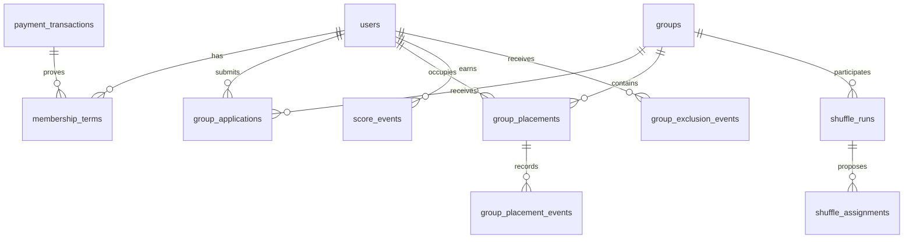

# P10 — Fiziksel veri modeli ve eski alan geçiş matrisi

**1 Ekim 2026. Durum:** uygulanabilir tasarım taslağı, migration değildir. Canlı `public` kolon adları Supabase'den salt okunur doğrulandı. Yeni tablo/kolonlar henüz oluşturulmadı. Ürün kararları D01–D10 alınmadan statü, süre, eşik veya hak varsayımı uygulanmaz.

## Sahiplik ve sınırlar

Bu çizim ilişki yönüdür; kesin kardinalite ve dönem kısıtları aşağıdaki karar kapılarına bağlıdır. `users` hesap kimliği kalır. Ücretli E4N hakkı, kapalı grup yerleşimi ve açık lonca ilişkisi birbirinden türetilmez.

| Hedef kayıt / anahtar | Gerekli alanlar ve ilişki | Mevcut kaynak / geçiş kuralı | Kesinleşme kapısı |
|---|---|---|---|
| `membership_terms.id` UUID; `user_id` → `users.id` | `valid_from`, `valid_until`, `state`, `evidence_payment_oid` → `payment_transactions.merchant_oid` nullable, `source`, `created_at` | `users.account_status`, `subscription_plan`, `subscription_end_date` mevcut; canlı 21 ACTIVE hesabın hiçbirinde bitiş tarihi yok. Bundan ücretli dönem üretme. Kanıtlı ödeme ve dönem varsa yeni kayıt oluştur. | D07 süre, ödeme aksaması, iade/iptal ve hak sırası. Eski kaydın `source=unknown_legacy` olarak sırf görünürlük için tutulması hak vermez. |
| `group_applications.id` UUID; `user_id`, `group_id` FK | `submitted_at`, `interviewed_at` nullable, `interviewer_user_id` nullable, `decision_at` nullable, `decision_by_user_id` nullable, `state`, `reason` nullable, `idempotency_key` | Canlı `group_members` yalnız 11 ACTIVE yerleşim gösterir; eski başvuru veya telefon görüşmesi satırı yok. Geçmiş başvuru üretme. | D08 karar yetkisi; D02–D04 başvuru yasağı; D09 kapasite. |
| `group_placements.id` UUID; `user_id`, `group_id` FK | `started_at`, `ended_at` nullable, `origin`, `source_group_member_id` nullable unique → `group_members.id`; `application_id` nullable | Canlı 11 `group_members` satırı bugünkü yerleşim olarak alınabilir; `joined_at` varsa zaman kaynağı, yoksa bilinmeyen geçmiş olarak işaretlenir. `ended_at` uydurulmaz. | Tek aktif yerleşim kuralı, shuffle geçişi ve eski `group_members` ile çift yazım bitişi P19/P20. |
| `group_placement_events.id` UUID; `placement_id` FK | `event_type`, `occurred_at`, `actor_user_id` nullable, `reason` nullable, `idempotency_key` unique, `run_id` nullable | Sadece geçişten sonraki kabul/taşıma/ayrılma/çıkarma olayları yazılır. Eski yerleşimin geçmişi bu tabloya otomatik kabul/çıkarma diye eklenmez. | D02–D04 çıkarma anlamı; P19/P23 tekrar sayımı. |
| `group_exclusion_events.id` UUID; `user_id` FK | `placement_event_id` unique nullable, `decision_source`, `occurred_at`, `ordinal`, `ban_until` nullable, `rule_version` | Eski `group_members` satırlarından çıkarma sayısı hesaplanmaz. Aynı olay ikinci kez ordinal artırmaz. | D03 ikinci/üçüncü sayım, D04 8 ay sınırı. |
| `score_events.id` UUID; `user_id` FK | `source_kind`, `source_id`, `period_key`, `points`, `rule_version`, `occurred_at`, `correction_of_id` nullable, `idempotency_key` unique | `users.performance_score` yalnız toplam görünümü; geçmiş aylık faaliyete dağıtılmaz. Yeni olaylar kanıtlı kaynaktan yazılır. | D01 faaliyet/puan/eşik/ay kapanışı. |
| `shuffle_runs.id` UUID; `period_key` | `rule_version`, `status`, `preview_hash`, `started_at`, `committed_at` nullable; `shuffle_assignments` eski/yeni grup, `user_id`, gerekçe, sonuç | Canlı tek grubun `cycle_months=6` değeri korunur; dört aya geçişin başlangıcı belli olmadan eski dönemi yeniden hesaplama. | D06 sert/tercih koşulları ve geçiş tarihi; P27–P29. |
| `service_offerings.id` UUID; `user_id` FK | `service_id`, `valid_from`, `valid_until` nullable, `evidence_source` | `users.profession` tek serbest metindir; çoklu hizmet ve çakışma kategorisine otomatik çevrilmez. Eşleme kanıtı olmadan “unknown” kalır. | D05 kategori/çoklu hizmet/çakışma matrisi. |
| Açık lonca | `power_team_members` şimdilik ayrı kaynak | Canlı 2 ilişkiyi kapalı `group_placements` içine taşımama. Lonca 35 kişi/görüşme/ban kuralını miras almaz. | P15 lonca kabul/ret sözlüğü. |

## Var olan tabloda alan düzeyi geçiş

| Alan | Yeni kullanım | Eski satır yaklaşımı |
|---|---|---|
| `users.account_status` | Hesabın giriş/idari durumu; üyelik hakkının tek kaynağı olmamalı. | 21 ACTIVE, 2 PENDING korunur; ücretli üyelik ataması yapılmaz. |
| `users.subscription_plan`, `subscription_end_date`, `last_membership_payment_amount` | Geçiş süresince eski ekran/API uyumluluğu; hedef hak `membership_terms` ve kanıtlı ödeme. | Bitiş tarihi dolu 0; boş tarihe dönem uydurulmaz. |
| `payment_transactions.merchant_oid` | Mevcut işlem anahtarı ve callback tekrar kontrolünün temeli. | 5 kaydın tüm `user_id` alanı boş; sahibine dış kanıt olmadan bağlanmaz. Yeni işlemde kullanıcı bağı uygulama düzeyinde zorunlu, eski NULL'ları koruyan kademeli DB kısıtı tasarlanır. |
| `group_members.status`, `joined_at`, `role` | Geçişte mevcut yerleşimin uyumluluk görünümü; başvuru/çıkarma geçmişi değildir. | 11 ACTIVE satır korunur. `INACTIVE`/`REJECTED` check'e rastgele eklenmez; yeni olay tablosu ve P11 sözlüğü önce gelir. |
| `groups.cycle_started_at`, `cycle_months` | Mevcut dönem verisi; yeni `shuffle_runs` dönemine açık bağlantı. | Canlı 6 ay değeri kendiliğinden 4'e çevrilmez. |
| `public_visitors.email` | Canlı kolon `NOT NULL`, fakat iki satır boş metin. | Boş metin geçersiz kanıt olarak ayrılır; geçmiş e-posta uydurulmaz. |
| `events` / `attendance` / `event_tickets` | Üyelik hak hesabını çağıran etkinlik/bilet akışı; katılım gerçek olayı ayrı. | Mevcut katılım kaydı veya fiyatı ücretli üyelik ispatı sayılmaz. |

## Kullanıcı silme ve FK saklama kapısı — 2 Ekim

Aktif admin silme yolunun `public_visitors.inviter_id` NO ACTION bağını temizlemediği izole testte görüldü: bağımlı ziyaretçi olan sentetik kullanıcı için HTTP 500 ve iki satır da rollback ile korundu; bağımsız kullanıcı 200/silindi. [[E4N/09-Dogrulama/P10-Uye-Silme-FK-Provasi|P10 FK provası]] ve H26. Bu, “her üye silinemez” ya da canlıda veri kaybı oldu iddiası değildir; veri şekline bağlı bir hata yoludur.

| İlişki kümesi | Canlı FK davranışı | Aktif silme kodu | Hedef karar |
|---|---|---|---|
| `public_visitors.inviter_id` | NO ACTION | Açık temizlik/anonimleştirme yok; izole bağlı satır silmeyi engelledi | Davet kaydı ve kullanıcı ayrışınca kimlik bağı mı kaldırılır, kayıt mı saklanır? |
| `payment_transactions.user_id`, `events.member_id` | NO ACTION | Açık işlem yok | Finansal ve etkinlik geçmişi korunurken hesap kapatma/silme ilişkisi. |
| `referrals`, `one_to_ones`, `tickets`, `visitors`, `champions` kullanıcı bağları | NO ACTION | `safeDelete` ile silme deneniyor; tüm SQL hataları geçilebiliyor | İşlem geçmişi ve üçüncü kişi kayıtlarının saklanması; başarısız alt silmenin yanıtı. |
| Kullanıcıya bağlı CASCADE ilişkiler | 12 FK | Bir kısmı ayrıca siliniyor, kalanları DB otomatik silebilir | Hangi satır geçmiş/kanıt olduğu için fiziksel silmeden korunacak? |
| `blogs.author_id` | SET NULL | Kodda açık işlem yok | Yazı kalırken yazar bağı ayrılacak mı? |

Karar verilene kadar `safeDelete` ile rastgele yeni tablo eklemek veya FK'leri topluca CASCADE'e çevirmek çözüm sayılmaz. P39 API hata sözleşmesi ve P10 saklama/anonimleştirme politikası birlikte belirlenir.

## Migration sırası ve değişmezler

1. P09 gerçek canlı yedek/geri yükleme ve güncel FK/satır sayımı; tüm işlem üretim dışı kopyada başlanır.
2. Mevcut kolonları silmeden yeni tablolar ve kısıtlar eklenir. `payment_transactions.user_id` eski NULL kayıtlar nedeniyle topluca `NOT NULL` yapılmaz. Eski API okuması çalışmaya devam eder.
3. Sadece kanıtlı satırlar taşınır: 11 yerleşim için kaynak ID bağlantısı; 5 ödeme için sahipliği bilinmiyor işareti; 23 hesabın hesap durumu korunur. Geçişten önce/sonra sayım ve FK yetim kontrolü yapılır.
4. Kodda yeni yazımlar `idempotency_key` ile tekilleştirilir; sonra okuma hedef modele geçirilir. Bir geçiş döneminde tek yetkili yazma kaynağı seçilir, çift yazım tutarsızlığı ölçülür.
5. Hak/başvuru/puan sonuçları D kararlarıyla ve P11 durum sözlüğüyle test edilmeden DB check, cron veya canlı uygulama açılmaz. Eski kolonların kaldırılması ayrı ileri migration'dır; veri yazımı başladıktan sonra kör ters DDL uygulanmaz.

Bu taslak, D01–D10'a cevap uydurmaz. Katalogdan şema kopyası ve geri yükleme kanıtı [[E4N/09-Dogrulama/P09-Canli-Katalog-Kopya-Provasi|P09 notunda]]. P10 Done koşulu somut FK/unique/check SQL'i, gerçek yedekli veri provası ve karar kayıtlarıdır.
